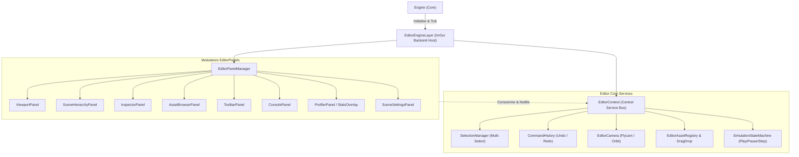
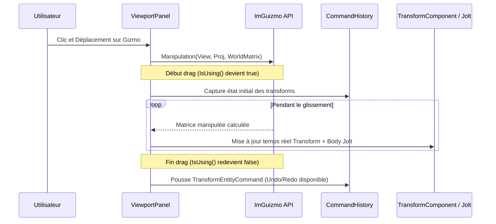
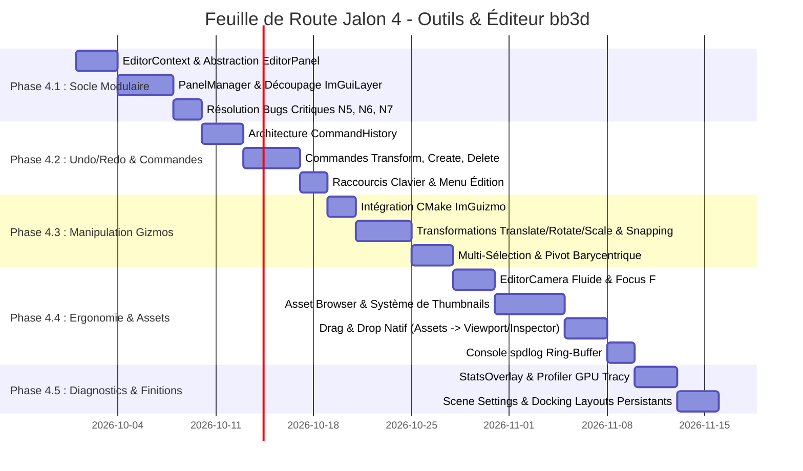

# 📐 Spécification Architecturale de l'Éditeur & IHM - biobazard3d (`bb3d`)

---

## 📋 Informations Générales

- **Titre :** Architecture Modulaire de l'Éditeur, Manipulation Spatiale & Pipeline d'Outils
- **Statut :** PROPOSÉ / EN REVUE D'ARCHITECTURE
- **Auteur :** Principal Engine Tools Architect & Editor Designer (`bb3d`)
- **Contexte Technique :** C++20, Vulkan 1.3/1.4 (Dynamic Rendering), Dear ImGui 1.91.8 (Docking branch), ImGuizmo, EnTT 3.13, SDL3
- **Portée :** Remplacement complet du monolithe `ImGuiLayer` (1161 lignes) et structuration intégrale du Jalon 4 de la feuille de route.

---

## 1. 🔍 État des Lieux & Diagnostic Critique

### 1.1. L'Anti-Pattern Monolithique Actuel
L'implémentation actuelle de l'éditeur repose entièrement sur deux fichiers :
- `include/bb3d/core/ImGuiLayer.hpp` (143 lignes)
- `src/bb3d/core/ImGuiLayer.cpp` (1161 lignes)

Ce design monolithique présente des défaillances architecturales majeures :
1. **Violation du Principe de Responsabilité Unique (SRP) :** `ImGuiLayer` cumule l'initialisation du backend graphique Vulkan ImGui, la gestion des polices, le dockspace, la hiérarchie EnTT, l'inspection de chaque composant, le picking de souris, la barre d'outils, la configuration d'environnement et les dialogues d'importation de fichiers.
2. **Couplage Fort & Temps de Compilation :** Chaque modification minime d'un champ d'inspecteur ou d'un bouton de toolbar force la recompilation de l'ensemble de `ImGuiLayer.cpp`, qui inclut lourdement `Engine.hpp`, `Scene.hpp`, `PhysicsWorld.hpp`, `PickingSystem.hpp`, `Material.hpp`, etc.
3. **Bugs d'États Partagés & Code Mort Répertoriés :**
   - **N5 (Dead Code) :** Ligne 823 de `ImGuiLayer.cpp`, un `else if` vide masque totalement la branche d'inspection du composant `LightComponent`.
   - **N6 (Shared Static State) :** Ligne 1035, `static glm::vec4 partCol` contamine toutes les entités possédant un `ParticleSystemComponent`.
   - **N7 (Shared Static State) :** Ligne 776, `static ModelLoadConfig s_loadConfig` applique les options d'importation d'une entité à toutes les autres.
4. **Absence d'Historique (Undo/Redo) :** Toute modification de translation, suppression d'entité ou changement de matériau est destructrice et irréversible.
5. **Absence de Manipulation Spatiale Directe (Gizmos) :** L'utilisateur est contraint de modifier les valeurs numériques dans des champs de texte `ImGui::DragFloat3`, sans manipulation visuelle 3D dans le viewport.
6. **Absence d'Asset Browser Interactif :** Le chargement d'assets repose sur des boîtes de dialogue bloquantes de l'OS (`portable-file-dialogs`) au lieu d'un explorateur d'assets avec drag & drop natif.

### 1.2. Directives de Conception & Règle Suprême (Règle 0)
- **Isolation Complète du Runtime Jeu :** Tout le code de l'éditeur réside sous l'espace de noms `bb3d::editor` et est conditionné par la directive de préprocesseur `#if defined(BB3D_ENABLE_EDITOR)`. En build Standalone/Release (`BB3D_ENABLE_EDITOR=OFF`), l'intégralité du binaire éditeur est éliminée (zéro surcharge CPU/GPU/mémoire).
- **Zéro Allocation dans le Hot-Path :** Aucun conteneur temporaire ne doit allouer sur le tas (`std::string`, `std::vector`) pendant les passes `onUpdate()` ou `onImGuiRender()`. Les chaînes d'affichage UI utilisent des buffers formateurs statiques ou `std::string_view`.
- **Data-Oriented Design & EnTT :** L'éditeur est un observateur et manipulateur de l'ECS EnTT. Il ne duplique pas l'état du monde, mais expose des descripteurs de commande.

---

## 2. 🏛️ Architecture Logicielle Modulaire Découplée

### 2.1. Vue d'Ensemble des Composants



---

### 2.2. Interface Abstraite `EditorPanel`

Chaque panneau de l'éditeur dérive d'une interface pure `EditorPanel`. Cette abstraction garantit un découplage total entre les fenêtres de l'éditeur :

```cpp
// include/bb3d/editor/EditorPanel.hpp
#pragma once

#if defined(BB3D_ENABLE_EDITOR)

#include <string_view>

union SDL_Event;

namespace bb3d::editor {

class EditorContext;

/**
 * @brief Interface abstraite de tout panneau composant l'espace de travail de l'éditeur.
 */
class EditorPanel {
public:
    virtual ~EditorPanel() = default;

    /** @brief Initialisation lors de l'attachement au PanelManager. */
    virtual void onAttach(EditorContext& context) { m_context = &context; }

    /** @brief Nettoyage des ressources lors du détachement. */
    virtual void onDetach() { m_context = nullptr; }

    /** @brief Mise à jour logique par frame (dt en secondes). */
    virtual void onUpdate([[maybe_unused]] float deltaTime) {}

    /** @brief Enregistrement des commandes graphiques Dear ImGui. */
    virtual void onImGuiRender() = 0;

    /** @brief Réception et traitement des événements d'entrée SDL3. */
    virtual void onEvent([[maybe_unused]] const SDL_Event& event) {}

    /** @brief Identifiant unique invariable du panneau (ex: "bb3d_viewport_panel"). */
    [[nodiscard]] virtual std::string_view getId() const = 0;

    /** @brief Titre affiché dans l'onglet ImGui (ex: "Viewport", "Inspector"). */
    [[nodiscard]] virtual std::string_view getTitle() const = 0;

    /** @brief Icône FontAwesome 6 optionnelle. */
    [[nodiscard]] virtual const char* getIcon() const { return ""; }

    /** @brief État d'ouverture/visibilité de la fenêtre ImGui. */
    [[nodiscard]] bool& isOpen() { return m_isOpen; }
    [[nodiscard]] bool isOpen() const { return m_isOpen; }
    void setOpen(bool open) { m_isOpen = open; }

protected:
    EditorContext* m_context = nullptr;
    bool m_isOpen = true;
};

} // namespace bb3d::editor

#endif // BB3D_ENABLE_EDITOR
```

---

### 2.3. Gestionnaire Central : `EditorContext` & `EditorPanelManager`

#### `EditorContext` : Le Bus de Données & d'État de l'Éditeur
Pour éliminer les variables statiques globales et le couplage direct entre panneaux, `EditorContext` encapsule la totalité de l'état interactif de l'éditeur.

```cpp
// include/bb3d/editor/EditorContext.hpp
#pragma once

#if defined(BB3D_ENABLE_EDITOR)

#include "bb3d/scene/Scene.hpp"
#include "bb3d/scene/Entity.hpp"
#include "bb3d/editor/CommandHistory.hpp"
#include "bb3d/editor/EditorCamera.hpp"
#include <vector>
#include <unordered_set>
#include <functional>

namespace bb3d::editor {

enum class SimulationState {
    Editing,
    Playing,
    Paused
};

enum class GizmoOperation {
    Translate,
    Rotate,
    Scale,
    Universal
};

enum class GizmoSpace {
    World,
    Local
};

struct GizmoSettings {
    GizmoOperation operation = GizmoOperation::Translate;
    GizmoSpace space = GizmoSpace::World;
    bool snapEnabled = false;
    float snapTranslation = 0.5f;   // 0.5 mètre
    float snapRotation = 15.0f;     // 15 degrés
    float snapScale = 0.1f;         // 0.1x
};

class EditorContext {
public:
    EditorContext() = default;

    // --- Gestion de Scène ---
    void setActiveScene(Scene* scene) { m_activeScene = scene; clearSelection(); }
    [[nodiscard]] Scene* getActiveScene() const { return m_activeScene; }

    // --- Gestion Multi-Sélection ---
    [[nodiscard]] const std::vector<Entity>& getSelectedEntities() const { return m_selectedEntities; }
    [[nodiscard]] Entity getPrimarySelectedEntity() const { 
        return m_selectedEntities.empty() ? Entity{} : m_selectedEntities.back(); 
    }
    [[nodiscard]] bool isSelected(Entity entity) const {
        return m_selectedSet.find(entity) != m_selectedSet.end();
    }
    void selectEntity(Entity entity, bool clearOthers = true);
    void deselectEntity(Entity entity);
    void toggleSelectEntity(Entity entity);
    void clearSelection();
    
    // --- Calcul Barycentrique du Pivot de Sélection ---
    [[nodiscard]] glm::vec3 computeSelectionCentroid() const;

    // --- Historique & Undo/Redo ---
    [[nodiscard]] CommandHistory& getHistory() { return m_history; }
    [[nodiscard]] const CommandHistory& getHistory() const { return m_history; }

    // --- Caméra Éditeur ---
    [[nodiscard]] EditorCamera& getEditorCamera() { return m_editorCamera; }
    [[nodiscard]] const EditorCamera& getEditorCamera() const { return m_editorCamera; }

    // --- Paramètres Gizmos & Outils ---
    [[nodiscard]] GizmoSettings& getGizmoSettings() { return m_gizmoSettings; }
    [[nodiscard]] const GizmoSettings& getGizmoSettings() const { return m_gizmoSettings; }

    // --- Contrôle de Simulation ---
    [[nodiscard]] SimulationState getSimulationState() const { return m_simState; }
    void setSimulationState(SimulationState state) { m_simState = state; }

private:
    Scene* m_activeScene = nullptr;
    std::vector<Entity> m_selectedEntities;
    std::unordered_set<entt::entity> m_selectedSet;

    CommandHistory m_history{ 100 }; // Borné à 100 commandes
    EditorCamera m_editorCamera;
    GizmoSettings m_gizmoSettings;
    SimulationState m_simState = SimulationState::Editing;
};

} // namespace bb3d::editor

#endif
```

#### `EditorPanelManager` : Orchestration & Cycle de Vie
Gère le registre des panneaux, le routage des événements et le rendu ImGui :

```cpp
// include/bb3d/editor/EditorPanelManager.hpp
#pragma once

#if defined(BB3D_ENABLE_EDITOR)

#include "bb3d/editor/EditorPanel.hpp"
#include "bb3d/editor/EditorContext.hpp"
#include <memory>
#include <vector>
#include <unordered_map>
#include <typeindex>

namespace bb3d::editor {

class EditorPanelManager {
public:
    explicit EditorPanelManager(EditorContext& context) : m_context(context) {}
    ~EditorPanelManager();

    template<typename T, typename... Args>
    T& addPanel(Args&&... args) {
        static_assert(std::is_base_of_v<EditorPanel, T>, "T must derive from EditorPanel");
        auto panel = std::make_unique<T>(std::forward<Args>(args)...);
        T& ref = *panel;
        panel->onAttach(m_context);
        m_panelMap[std::type_index(typeid(T))] = panel.get();
        m_panels.push_back(std::move(panel));
        return ref;
    }

    template<typename T>
    [[nodiscard]] T* getPanel() const {
        auto it = m_panelMap.find(std::type_index(typeid(T)));
        if (it != m_panelMap.end()) {
            return static_cast<T*>(it->second);
        }
        return nullptr;
    }

    void onUpdate(float deltaTime);
    void onImGuiRender();
    void onEvent(const SDL_Event& event);

    [[nodiscard]] const std::vector<std::unique_ptr<EditorPanel>>& getPanels() const { return m_panels; }

private:
    EditorContext& m_context;
    std::vector<std::unique_ptr<EditorPanel>> m_panels;
    std::unordered_map<std::type_index, EditorPanel*> m_panelMap;
};

} // namespace bb3d::editor

#endif
```

---

## 3. 🖥️ Spécification Exhaustive des Panneaux d'Édition

### 3.1. `ViewportPanel` (Rendu Offscreen & Interaction 3D)
- **Rendu RTT (Render To Texture) :** Connecté au `RenderTarget` offscreen (HDR `R16G16B16A16_SFLOAT`).
- **Synchronisation Dynamique de l'Aspect Ratio :** Détecte la taille du rectangle client ImGui via `ImGui::GetContentRegionAvail()`. Ne déclenche de redimensionnement de `RenderTarget` que si la taille diffère de plus de 1 pixel après debounce, garantissant zéro déformation d'image (ratio 1:1 parfait sans étirement).
- **Caméra Éditeur vs Caméra Jeu :**
  - Permet de basculer en 1 clic entre la caméra libre de travail (`EditorCamera`) et la caméra active définie par un composant `CameraComponent` de la scène.
- **Contrôleur `EditorCamera` Intégré :**
  - **Mode Flycam :** Clic Droit maintenu + `ZQSD`/`WASD` + `A`/`E` (élévation). Vitesse ajustable dynamiquement via la molette de la souris.
  - **Mode Orbit (Maya) :** `Alt` + Clic Gauche : rotation orbitale autour du point de focalisation.
  - **Mode Pan :** `Alt` + Clic Molette : translation latérale dans le plan de vue.
  - **Focus sur Sélection (`F`) :** Calcule la boîte englobante AABB de l'entité sélectionnée et positionne la caméra pour la cadrer immédiatement.
- **Picking Sous-Pixel :** Conversion des coordonnées écran absolues de la souris en UV normalisés `[0.0, 1.0]` transmis au `PickingSystem` GPU/Raycast.
- **Overlay de Statistiques & Contrôles Rapides :** Bouton pour afficher/masquer la grille 3D, basculer la projection (Perspective/Orthographique) et afficher la vitesse de caméra.

---

### 3.2. `SceneHierarchyPanel` (Arborescence EnTT & Structure de Scène)
- **Arborescence Parent/Enfant :**
  - Exploitation d'un composant structurel `HierarchyComponent` (stockant `entt::entity parent`, `std::vector<entt::entity> children`).
  - Dépliage récursif via `ImGui::TreeNodeEx` avec indentation personnalisée.
- **Glisser-Déposer pour Reparentage (Drag-to-Reparent) :**
  - Utilisation des payloads ImGui `BB3D_DND_ENTITY` pour glisser une entité sur une autre et modifier sa hiérarchie instantanément avec conversion de coordonnées globales/locales.
- **Filtrage & Recherche Instantanée :**
  - Barre de recherche avec filtrage à la volée insensible à la casse.
  - Mise en surbrillance automatique des nœuds correspondants et ouverture automatique des parents pour afficher les entités isolées trouvées.
- **Visibilité & Verrouillage Rapides :**
  - Colonnes d'icônes à droite du nom d'entité : icône œil (bascule `visible` dans `MeshComponent`), icône cadenas (empêche la sélection accidentelle dans le viewport).
- **Menu Contextuel Riche (Clic Droit) :**
  - Création d'entités primitives (Cube, Sphère, Plan, Cylindre, Tore).
  - Création de lumières (Directionnelle, Point Light, Spot Light).
  - Création de caméra (Perspective, Orbit, FPS).
  - Émetteurs de particules, sources audio.
  - Suppression d'entité liée au gestionnaire d'Undo/Redo.

---

### 3.3. `InspectorPanel` & Property Drawers Modulaires
L'inspection d'entité abandonne les blocs imbriqués monolithiques au profit d'un registre de tiroirs de propriétés (`IComponentDrawer`) :

```cpp
// include/bb3d/editor/ComponentDrawer.hpp
#pragma once

#if defined(BB3D_ENABLE_EDITOR)

#include "bb3d/scene/Entity.hpp"
#include "bb3d/editor/EditorContext.hpp"

namespace bb3d::editor {

class IComponentDrawer {
public:
    virtual ~IComponentDrawer() = default;
    [[nodiscard]] virtual std::string_view getComponentName() const = 0;
    [[nodiscard]] virtual const char* getIcon() const = 0;
    [[nodiscard]] virtual bool hasComponent(Entity entity) const = 0;
    virtual void addComponent(Entity entity) = 0;
    virtual void removeComponent(Entity entity) = 0;
    virtual void draw(Entity entity, EditorContext& context) = 0;
};

} // namespace bb3d::editor

#endif
```

#### Widgets Stylisés à 3 Axes (Position, Rotation, Échelle)
Chaque composant vectoriel est affiché selon la convention ergonomique moderne des moteurs AAA :
- Boutons distincts colorés : **X** (Rouge `#E04040`), **Y** (Vert `#40E040`), **Z** (Bleu `#4080FF`).
- Un simple clic sur le bouton d'axe réinitialise cet axe spécifique à sa valeur par défaut (0 pour pos/rot, 1 pour scale).
- Support du glissement interactif fluide avec pas adaptatif (`ImGui::DragFloat`).

#### Élimination Garantie des Bugs N5, N6, N7
- **Correction N5 (Light mort) :** Implémentation isolée dans `LightComponentDrawer`, élimination de tout `else if` fantôme.
- **Correction N6 (Particle color partagée) :** Élimination définitive de `static glm::vec4 partCol`. La couleur est lue et écrite directement dans le composant `ParticleSystemComponent` ou son `ParticleMaterial`.
- **Correction N7 (ModelLoadConfig partagé) :** Élimination du `static ModelLoadConfig`. Les options d'importation sont stockées par entité ou dans une structure de métadonnées d'asset.

---

### 3.4. `AssetBrowserPanel` / `ContentDrawer`
- **Exploration Virtuelle & Système de Fichiers :**
  - Point d'entrée calibré sur le répertoire `assets/`.
  - Panneau gauche : Arborescence hiérarchique de dossiers (`assets/models`, `assets/textures`, `assets/shaders`, `assets/audio`, `assets/scenes`).
  - Panneau droit : Grille d'icônes ou liste détaillée des fichiers avec prévisualisation.
- **Système de Cache de Vignettes (Thumbnails Cache) :**
  - Génération asynchrone via `JobSystem` et mise en cache des miniatures de textures (`.png`, `.jpg`, `.ktx2`) et de maillages (`.obj`, `.gltf`).
  - Icônes vectorielles spécifiques par type de fichier via FontAwesome 6 pour les shaders (`.vert`, `.frag`, `.spv`), fichiers audio (`.wav`, `.ogg`) et scènes (`.json`).
- **Drag & Drop Universel Natif ImGui :**
  - **Maillage vers Viewport :** Glisser un `.obj`/`.gltf` depuis l'Asset Browser et le relâcher dans le Viewport 3D instancie automatiquement une nouvelle entité `Model` à la position d'impact du rayon souris sur le sol.
  - **Texture vers Inspecteur :** Glisser un `.png` sur un slot de texture d'un matériau PBR (Albedo, Normal, ORM, Emissive) assigne instantanément la ressource avec rechargement asynchrone sans gel d'image.
  - **Scène vers Fenêtre :** Glisser un fichier `.json` propose l'ouverture et le chargement immédiat de la scène.

---

### 3.5. `ToolbarPanel` (Contrôles de Simulation & Outils)
- **Machine d'États de Simulation :**
  - **Bouton Play (`F5`) :** Enregistre un instantané sérialisé de la scène en RAM, active la simulation physique Jolt et démarre les scripts natifs.
  - **Bouton Pause (`F6`) :** Gèle l'incrément de temps global (`deltaTime = 0.0f`), maintenant l'affichage et l'inspection actifs.
  - **Bouton Step Frame (`F10`) :** Avance la simulation d'un pas fixe d'exactement $1/60$ s pour déboguer les collisions physiques frame-par-frame.
  - **Bouton Stop (`Shift+F5`) :** Arrête la simulation et restaure l'état exact de la scène depuis l'instantané pré-simulation.
- **Sélecteurs d'Outils Gizmos :**
  - Boutons radio pour Translation (`W`), Rotation (`E`), Échelle (`R`).
  - Basculeur d'Espace de Référence : **World** (`Ctrl+W`) vs **Local** (`Ctrl+L`).
  - Paramètres de Snapping interactifs : activation et valeurs réglables (Grille, Angles, Échelle).
- **Raccourcis Utilitaires :**
  - Capture d'écran instantanée haute résolution enregistrée dans `screenshots/`.
  - Rechargement à chaud des shaders (Hot-Reloading).

---

### 3.6. `ConsolePanel` (Journalisation spdlog en Temps Réel)
- **Sink Mémoire Personnalisé (`EditorConsoleSink`) :**
  - Implémente `spdlog::sinks::base_sink<std::mutex>` capturant les logs sans bloquer les threads du moteur.
  - Ring-buffer circulaire borné (ex: 2048 entrées) pour une mémoire constante et zéro allocation dynamique hors initialisation.
- **Filtrage Multi-Niveaux & Ergonomie :**
  - Boutons de filtrage rapide avec compteurs actifs : Trace (Gris), Info (Blanc), Warning (Jaune), Error (Rouge), Critical (Magenta).
  - Barre de recherche textuelle avec filtrage par sous-chaîne ou regex.
  - Option "Clear on Play" et "Auto-scroll".
  - Copie dans le presse-papier des messages sélectionnés et double-clic pour afficher le fichier source et la ligne d'émission.

---

### 3.7. `ProfilerPanel` & `StatsOverlay`
- **StatsOverlay (In-Viewport HUD) :**
  - Affichage semi-transparent ancré dans le coin supérieur droit du Viewport 3D.
  - Métriques clés : FPS instantané, Frametime CPU (moyenne lissée sur 60 frames), Frametime GPU Tracy.
  - Statistiques de Rendu : Nombre de draw calls, batches instanciés, polygones (triangles) totaux affichés, sommets traités.
  - Compteurs de scène : Nombre d'entités actives dans EnTT, corps physiques simulés dans Jolt.
- **ProfilerPanel Avancé :**
  - Graphiques déroulants temps réel (Frame Time Graphs).
  - Diagnostic VMA (Vulkan Memory Allocator) : VRAM dédiée allouée, mémoire hôte partagée, taux de fragmentation de la mémoire graphique.
  - Décomposition des passes GPU Vulkan balisées via `TracyVkZone` (`ShadowPass`, `OpaquePBR`, `PostProcess`, `ImGuiUI`).

---

### 3.8. `SceneSettingsPanel` (Environnement & Rendu)
- **Environnement & Ciel :**
  - Configuration du type d'environnement : Couleur unie, Skybox Cubemap HDRI ou SkySphere panoramique.
  - Ajustement des paramètres atmosphériques (intensité de diffusion, orientation du soleil).
- **Brouillard Volumétrique / Distance :**
  - Type (None, Linear, Exponential, Exponential Squared).
  - Sélecteur de couleur HDR, densité, plans de début/fin.
- **Réglages Cascaded Shadow Maps (CSM) :**
  - Configuration directe des biais de profondeur : Normal Bias, Shader Depth Bias, Pipeline Constant Bias, Slope Bias pour éliminer en temps réel le "Peter Panning" et le "Shadow Acne".
- **Pipeline de Post-Traitement (Tone Mapping & Effets) :**
  - Tonalité : ACES, Reinhard, Uncharted 2, Filmic.
  - Exposition, contraste, saturation, Bloom (seuil, intensité), Vignette.

---

## 4. 🕹️ Système de Manipulation 3D (Gizmos & ImGuizmo)

### 4.1. Architecture d'Intégration d'ImGuizmo
ImGuizmo permet l'interaction spatiale directe dans le Viewport 3D. Son intégration propre dans Vulkan nécessite de gérer la spécificité des systèmes de coordonnées.



### 4.2. Adaptation des Coordonnées Vulkan vs ImGuizmo
Vulkan utilise un système de coordonnées avec un axe Y pointant vers le bas et une profondeur $Z \in [0, 1]$, tandis qu'ImGuizmo attend une projection de style OpenGL standard ($Y$ vers le haut, $Z \in [-1, 1]$) :

```cpp
// Conversion de la matrice de projection pour ImGuizmo
glm::mat4 projForGizmo = camera.getProjectionMatrix();
// Vulkan a m_proj[1][1] inversé par rapport à OpenGL
projForGizmo[1][1] *= -1.0f; 

ImGuizmo::SetOrthographic(camera.isOrthographic());
ImGuizmo::SetDrawlist();
ImGuizmo::SetRect(viewportPos.x, viewportPos.y, viewportSize.x, viewportSize.y);

glm::mat4 viewMatrix = camera.getViewMatrix();
glm::mat4 modelMatrix = entity.get<TransformComponent>().getWorldMatrix();

// Snapping configurable
float snapValues[3] = { snapValue, snapValue, snapValue };
bool isSnapped = context.getGizmoSettings().snapEnabled;

ImGuizmo::Manipulate(
    glm::value_ptr(viewMatrix),
    glm::value_ptr(projForGizmo),
    currentGizmoOp,
    currentGizmoMode,
    glm::value_ptr(modelMatrix),
    nullptr,
    isSnapped ? snapValues : nullptr
);
```

### 4.3. Multi-Sélection & Centre de Pivot Barycentrique
Lorsque plusieurs entités sont sélectionnées :
1. **Calcul du Barycentre :**
   $$\mathbf{C} = \frac{1}{N} \sum_{i=1}^{N} \mathbf{T}_i$$
   où $\mathbf{T}_i$ est la translation absolue de l'entité $i$.
2. **Matrice de Pivot Virtuel :** Un gizmo virtuel est positionné en $\mathbf{C}$ avec une orientation neutre (ou alignée sur la sélection principale).
3. **Application de la Transformation Relative :**
   À chaque frame de manipulation, le delta de transformation $\Delta \mathbf{M} = \mathbf{M}_{\text{courante}} \cdot \mathbf{M}_{\text{précédente}}^{-1}$ est appliqué à l'ensemble des entités du groupe relativement au pivot $\mathbf{C}$.
4. **Synchronisation Physique Immédiate :** Si une entité possède un `PhysicsComponent`, son homologue rigide dans Jolt Physics est immédiatement mis à jour via `PhysicsWorld::updateBodyTransform()` pour éviter tout décalage entre rendu et simulation.

---

## 5. ⏪ Système d'Undo/Redo (Command Pattern)

### 5.1. Interface Abstraite `EditorCommand`

```cpp
// include/bb3d/editor/EditorCommand.hpp
#pragma once

#if defined(BB3D_ENABLE_EDITOR)

#include <string_view>
#include <memory>

namespace bb3d::editor {

/**
 * @brief Commande réversible exécutable par l'éditeur.
 */
class EditorCommand {
public:
    virtual ~EditorCommand() = default;

    /** @brief Applique ou ré-applique l'action. */
    virtual void execute() = 0;

    /** @brief Annule l'action et restaure l'état exact antérieur. */
    virtual void undo() = 0;

    /** @brief Nom descriptif affiché dans le menu Édition (ex: "Déplacer Entité", "Supprimer Cube"). */
    [[nodiscard]] virtual std::string_view getName() const = 0;

    /** @brief Possibilité de fusionner deux actions continues consécutives (ex: glissement de slider). */
    [[nodiscard]] virtual bool canMergeWith([[maybe_unused]] const EditorCommand& other) const { return false; }
    virtual void mergeWith([[maybe_unused]] const EditorCommand& other) {}
};

} // namespace bb3d::editor

#endif
```

---

### 5.2. Gestionnaire d'Historique Borné : `CommandHistory`

```cpp
// include/bb3d/editor/CommandHistory.hpp
#pragma once

#if defined(BB3D_ENABLE_EDITOR)

#include "bb3d/editor/EditorCommand.hpp"
#include <deque>
#include <memory>

namespace bb3d::editor {

class CommandHistory {
public:
    explicit CommandHistory(size_t maxHistorySize = 100) : m_maxSize(maxHistorySize) {}

    void executeCommand(std::unique_ptr<EditorCommand> command) {
        if (!command) return;

        // Tente la fusion avec la commande précédente (ex: glissement de souris continu)
        if (!m_undoStack.empty() && m_undoStack.back()->canMergeWith(*command)) {
            m_undoStack.back()->mergeWith(*command);
            m_undoStack.back()->execute();
            m_redoStack.clear();
            return;
        }

        command->execute();
        m_undoStack.push_back(std::move(command));
        m_redoStack.clear();

        // Maintien de la borne maximale de mémoire
        if (m_undoStack.size() > m_maxSize) {
            m_undoStack.pop_front();
        }
    }

    bool undo() {
        if (m_undoStack.empty()) return false;
        auto cmd = std::move(m_undoStack.back());
        m_undoStack.pop_back();
        cmd->undo();
        m_redoStack.push_back(std::move(cmd));
        return true;
    }

    bool redo() {
        if (m_redoStack.empty()) return false;
        auto cmd = std::move(m_redoStack.back());
        m_redoStack.pop_back();
        cmd->execute();
        m_undoStack.push_back(std::move(cmd));
        return true;
    }

    [[nodiscard]] bool canUndo() const { return !m_undoStack.empty(); }
    [[nodiscard]] bool canRedo() const { return !m_redoStack.empty(); }
    
    [[nodiscard]] std::string_view getUndoCommandName() const {
        return m_undoStack.empty() ? "" : m_undoStack.back()->getName();
    }
    [[nodiscard]] std::string_view getRedoCommandName() const {
        return m_redoStack.empty() ? "" : m_redoStack.back()->getName();
    }

    void clear() {
        m_undoStack.clear();
        m_redoStack.clear();
    }

private:
    size_t m_maxSize;
    std::deque<std::unique_ptr<EditorCommand>> m_undoStack;
    std::deque<std::unique_ptr<EditorCommand>> m_redoStack;
};

} // namespace bb3d::editor

#endif
```

---

### 5.3. Commandes Concrètes Essentielles

1. **`TransformEntityCommand` :** Stocke les identifiants d'entités, leurs positions/rotations/échelles avant et après manipulation.
2. **`CreateEntityCommand` :** Enregistre la définition archétypale de l'entité. `undo()` détruit l'entité de la scène EnTT, `redo()` la recrée à l'identique.
3. **`DestroyEntityCommand` :** Sérialise l'entité et tous ses composants en mémoire JSON avant destruction. `undo()` désérialise et restaure l'entité complète avec tous ses paramètres.
4. **`ChangeComponentPropertyCommand<T>` :** Commande template générique capturant l'état d'un composant avant et après modification par un tiroir de l'Inspecteur.
5. **`ReparentEntityCommand` :** Modifie le lien parent/enfant dans la hiérarchie tout en préservant le transform mondial de l'enfant.

---

## 6. 📅 Plan de Développement Découpé & Phasé (Jalon 4)

Le Jalon 4 de la feuille de route est structuré en **5 phases séquentielles**, chacune validée par des tests unitaires et vérifications TDD :



---

### 4.1. Phase 4.1 : Socle Modulaire & Découpage de l'Éditeur
- **T4.1.1 : Infrastructure Centrale (`EditorContext`, `EditorPanel`)**
  - Création de `include/bb3d/editor/EditorPanel.hpp` et `EditorContext.hpp`.
  - Implémentation du bus de sélection et de l'état de simulation.
  - Test unitaire : `tests/unit_test_36_editor_context.cpp` (validation de la sélection, multi-sélection, calcul de barycentre).
- **T4.1.2 : Orchestration (`EditorPanelManager`) & Refonte de `ImGuiLayer`**
  - Allègement de `ImGuiLayer` en un simple exécuteur de backend (`EditorLayer`).
  - Découpage de `ImGuiLayer.cpp` (1161 lignes) en panneaux indépendants dans `src/bb3d/editor/panels/`.
- **T4.1.3 : Éradication des Bugs Statiques N5, N6, N7**
  - Suppression de la branche vide duplicate Light (N5).
  - Suppression des statiques `partCol` (N6) et `s_loadConfig` (N7).
  - Validation CTest sans aucune régression.

### 4.2. Phase 4.2 : Système de Commande & Historique Undo/Redo
- **T4.2.1 : Moteur de Commandes (`EditorCommand`, `CommandHistory`)**
  - Implémentation de la pile bornée à 100 actions et détection de fusion (merging).
  - Test unitaire : `tests/unit_test_37_editor_command_history.cpp` (validation Undo, Redo, limite mémoire, dirty flag).
- **T4.2.2 : Commandes ECS Fondamentales**
  - `TransformEntityCommand` : modification réversible de position, rotation, échelle.
  - `CreateEntityCommand` & `DestroyEntityCommand` avec restauration complète des composants.
- **T4.2.3 : Interface Utilisateur & Raccourcis**
  - Raccourcis `Ctrl+Z` (Undo), `Ctrl+Y` ou `Ctrl+Shift+Z` (Redo).
  - Intégration dans la barre de menu principale (`showMainMenu()`).

### 4.3. Phase 4.3 : Manipulation 3D Temps Réel & Gizmos ImGuizmo
- **T4.3.1 : Dépendance ImGuizmo via FetchContent**
  - Ajout propre de `FetchContent_Declare(imguizmo ...)` dans `CMakeLists.txt`.
  - Compilation isolée sous `#if defined(BB3D_ENABLE_EDITOR)`.
- **T4.3.2 : Intégration Mathématique & Système de Coordonnées**
  - Calcul et injection des matrices View et Projection adaptées à Vulkan (inversion Y).
  - Prise en charge des modes Translation, Rotation, Échelle en espace World et Local.
  - Snapping configurable (grille 0.5m, angle 15°, échelle 0.1x).
- **T4.3.3 : Multi-Sélection & Pivot Barycentrique**
  - Manipulation collective d'un groupe d'entités avec mise à jour temps réel des corps physiques Jolt.
  - Génération d'une commande unique d'Undo lors du relâchement du gizmo.

### 4.4. Phase 4.4 : Ergonomie de Navigation, Assets & Console
- **T4.4.1 : Caméra Éditeur Professionnelle (`EditorCamera`)**
  - Navigation Flycam (`WASD` + RMB) avec vitesse modifiable à la molette.
  - Navigation Orbit (`Alt` + LMB) et Pan (`Alt` + MMB).
  - Cadrage automatique de la sélection avec la touche `F`.
- **T4.4.2 : Explorateur d'Assets (`AssetBrowserPanel`)**
  - Navigation arborescente dans `assets/` et affichage en grille d'icônes.
  - Cache de vignettes de prévisualisation (textures et modèles 3D).
- **T4.4.3 : Drag & Drop Universel ImGui**
  - Déposer un maillage 3D dans le Viewport instancie le modèle au point d'intersection de la souris.
  - Déposer une image sur un slot de texture dans l'Inspecteur assigne la texture au matériau PBR.
- **T4.4.4 : Panneau Console Interactif (`ConsolePanel`)**
  - Création de `EditorConsoleSink` connecté à `spdlog`.
  - Filtres par sévérité, recherche textuelle, auto-scroll et vidage.

### 4.5. Phase 4.5 : Diagnostics Temps Réel & Paramétrage Avancé
- **T4.5.1 : Profiler & StatsOverlay dans le Viewport**
  - Overlay HUD semi-transparent affichant FPS, frametimes CPU/GPU, compteurs de polygones et draw calls.
  - Suivi de la mémoire VRAM allouée via VMA.
- **T4.5.2 : Panneau de Configuration de Scène (`SceneSettingsPanel`)**
  - Interface dédiée pour les ombres CSM (ajustement live des biais), brouillard et skybox.
  - Paramétrage du pipeline de post-traitement (Tone mapping, Bloom).
- **T4.5.3 : Persistance des Dispositions Docking (Layouts)**
  - Sauvegarde et chargement de la disposition ImGui dans `assets/config/editor_layout.ini`.
  - Presets de disposition : "Défaut", "Level Design", "Animation", "Débogage & Profilage".

---

## 7. ⚖️ Grille de Validation & Critères d'Acceptation Architecturale

| Critère | Cible | Vérification |
| :--- | :--- | :--- |
| **Modularité** | Aucun fichier de panneau > 400 lignes | Audit statique du nombre de lignes dans `src/bb3d/editor/panels/` |
| **Étanchéité Release** | 0 octet ImGui en mode standalone (`BB3D_ENABLE_EDITOR=OFF`) | `dumpbin /symbols` ou vérification des dépendances d'exécutable |
| **Undo/Redo** | Restauration parfaite de 100 actions consécutives | Test unitaire automatisé `unit_test_37_editor_command_history` |
| **Performance Temps Réel** | 0 allocation dynamique sur le hot-path d'affichage UI | Inspection Tracy Profiler & allocateurs |
| **Gizmos ImGuizmo** | Snapping précis et manipulation fluide sans scintillement | Validation visuelle dans le Viewport |
| **Drag & Drop** | Assignation instantanée sans blocage de frame | Test interactif d'instanciation de modèles et textures |
