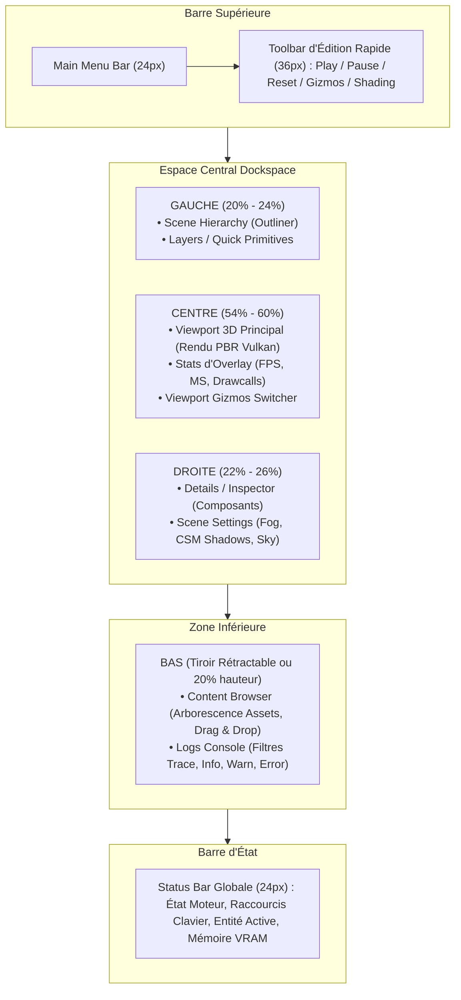
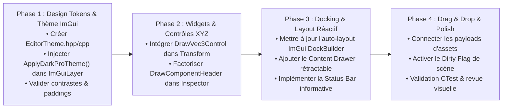

# biobazard3d (bb3d) — Editor UI/UX Design System Specification
**Version :** 2.0.0-PRO  
**Auteur :** Lead UI/UX & Graphic Designer  
**Statut :** Spécification Maîtresse d'Ingénierie & Design  
**Date :** 2026-09-26  
**Inspiration :** Unreal Engine 5 (Slate), Blender 4 (Dark Studio), Godot 4 (Clean Slate)

---

## 1. Vision Ergonomique & Philosophie DCC

L'éditeur biobazard3d est l'outil central de création, de débogage physique/graphique et de composition de scènes temps réel du moteur. Pour permettre des sessions de travail prolongées (8h+) sans fatigue visuelle ni friction cognitive, l'interface doit adopter les principes fondamentaux des outils DCC modernes :

1. **Zero-Distraction Dark Slate** : L'interface s'efface pour sublimer le Viewport 3D. Le contraste n'est jamais agressif (aucun noir pur `#000000` ni blanc pur `#FFFFFF`). Les tons neutres sont dérivés d'une ardoise charbon légèrement bleutée.
2. **Hiérarchie Visuelle à 3 Niveaux** :
   - *Niveau 1 (Contexte Global)* : Barre de menu, dockspace, séparateurs, status bar.
   - *Niveau 2 (Organisation Spatiale)* : Onglets de panneaux, en-têtes de collapsing headers, barres d'outils.
   - *Niveau 3 (Champs de Données & Contrôles)* : Sliders, inputs, boutons colorés XYZ, toggles d'état.
3. **Efficacité Gestuelle & Rétroaction Immédiate** :
   - Micro-interactions avec transitions d'état évidentes (Hover, Active, Dragging, Focus).
   - Accès rapide aux réinitialisations (clic droit ou bouton d'axe X/Y/Z).
   - Indicateurs d'état non sauvegardé (*dirty flag*) visibles d'un coup d'œil.
   - Drag & Drop guidé par outline lumineux néon.

```
+---------------------------------------------------------------------------------------------------+
|  File   Edit   View   Scene   Build   Help                                           [ - | □ | X ]|
+---------------------------------------------------------------------------------------------------+
|  [► Play] [⏸ Pause] [↺ Reset]  |  [+] Gizmo: Local ▼ | Grid: On | Cam: Orbit ▼ | [📷 Screenshot]  |
+-------------------+---------------------------------------------------+---------------------------+
| 📁 OUTLINER       | 🖼 VIEWPORT 3D (Focus Principal)                  | 🎛 DETAILS / INSPECTOR    |
| 🔍 Filter...      | [ Perspective | Shaded | Lit | 60 FPS | 16.6ms ]   | 🏷 Entity: "Spaceship_01"  |
| ----------------- |                                                   | [✓ Active]  ● Unsaved     |
| ▼ 🌍 Scene Root   |                                                   +---------------------------+
|   ► 📷 Orbit Cam  |                                                   | ▼ TRANSFORM               |
|   ▼ 🚀 Spaceship  |                                                   |   Position:               |
|     • 📦 Mesh     |                 [ 3D Render Area ]                |   [X| 12.5 ] [Y| 0.0] [Z| 3.2] |
|     • 🧲 Physics  |                                                   |   Rotation:               |
|   ► 💡 Sun Light  |                                                   |   [X|  0.0 ] [Y|45.0] [Z| 0.0] |
|                   |                                                   | ▼ PBR MATERIAL            |
+-------------------+                                                   |   Albedo: [🎨 Swatch]     |
| 📦 CONTENT DRAWER / LOGS (Docké ou Tiroir UE5)                        |   Roughness: [---|--- 0.4]|
| [📂 assets/models/rockets]                                            +---------------------------+
|   [🚀 rocket_1.obj]  [🚀 rocket_2.gltf]  [🎨 wood_diff.png]          | ⚙ SCENE SETTINGS (Tab)    |
+---------------------------------------------------------------------------------------------------+
| ℹ Ready | Vulkan 1.3 | VSync: ON | 1920x1080 | Selected: "Spaceship_01" (ID: 42) | Physics: 60Hz   |
+---------------------------------------------------------------------------------------------------+
```

---

## 2. Design System & Palette Visuelle "Dark Pro"

### 2.1 Modèle en Couches (Elevation & Layering)

Pour conférer du relief et guider l'œil sans surcharger l'écran, l'interface utilise 5 couches d'élévation lumineuse :

| Layer | Rôle Visuel | Hexadécimal | RGBA Normalisé ImGui | Description & Utilisation |
| :--- | :--- | :--- | :--- | :--- |
| **Layer 0** | Fond Dockspace / Canvas neutre | `#121417` | `(0.071f, 0.078f, 0.090f, 1.00f)` | L'arrière-plan le plus profond, visible entre les panneaux détachés. |
| **Layer 1** | Fond de Fenêtre / Panneau | `#1A1D21` | `(0.102f, 0.114f, 0.129f, 1.00f)` | Surfaces principales des fenêtres (Outliner, Inspector, Viewport frame). |
| **Layer 2** | Fond de Zone Interne / Child / Listes | `#15171B` | `(0.082f, 0.090f, 0.106f, 1.00f)` | Arborescences, tables d'assets, zones défilables pour creuser visuellement. |
| **Layer 3** | Frames Inactives / Inputs / Widgets | `#22262C` | `(0.133f, 0.149f, 0.173f, 1.00f)` | Boîtes de saisie texte, sliders, champs numériques au repos. |
| **Layer 4** | Frames Survolées (Hover) | `#2C313A` | `(0.173f, 0.192f, 0.227f, 1.00f)` | Rétroaction instantanée sous le pointeur de la souris. |
| **Layer 5** | Frames Actives / Enfoncées (Active) | `#353B45` | `(0.208f, 0.231f, 0.271f, 1.00f)` | Clic enfoncé, manipulation continue d'un slider. |

---

### 2.2 Palette des Accents & Sémantique

La palette d'accentuation s'inspire du code couleur industriel sobre d'Unreal Engine 5 et Blender :

| Rôle Sémantique | Teinte | Hex | RGBA ImGui | Utilisation |
| :--- | :--- | :--- | :--- | :--- |
| **Accent Primaire** | Steel Blue UE5 | `#2D6CDF` | `(0.176f, 0.424f, 0.875f, 1.00f)` | Sélections actives, onglet actif, focus outline, boutons d'action principale. |
| **Accent Primaire Hover** | Electric Blue | `#4282F5` | `(0.259f, 0.510f, 0.961f, 1.00f)` | Survol d'un onglet ou d'un bouton primaire. |
| **Accent Primaire Active**| Deep Slate Blue | `#2254B0` | `(0.133f, 0.329f, 0.690f, 1.00f)` | Clic confirmé sur l'accent primaire. |
| **Accent Sélection / Warm**| Unreal Gold / Amber | `#E58E26` | `(0.898f, 0.557f, 0.149f, 1.00f)` | Bounding box de sélection 3D, indicateur d'état non sauvegardé (*dirty*), warning. |
| **Axe X (Rouge)** | Red Coral Désaturé | `#E04747` | `(0.878f, 0.278f, 0.278f, 1.00f)` | Bouton d'axe X dans les transforms, gizmo X. |
| **Axe Y (Vert)** | Emerald Green Désaturé | `#47B347` | `(0.278f, 0.702f, 0.278f, 1.00f)` | Bouton d'axe Y dans les transforms, gizmo Y. |
| **Axe Z (Bleu)** | Cobalt Blue Désaturé | `#387CD9` | `(0.220f, 0.486f, 0.851f, 1.00f)` | Bouton d'axe Z dans les transforms, gizmo Z. |
| **Succès / Actif** | Vivid Green | `#2ECC71` | `(0.180f, 0.800f, 0.443f, 1.00f)` | Toggles de composants activés, état moteur "Running". |
| **Erreur / Danger** | Crimson Red | `#E63946` | `(0.902f, 0.224f, 0.275f, 1.00f)` | Suppression irréversible, erreurs logs dans la console. |

---

### 2.3 Métriques Spatiales, Arrondis & Densité Visuelle

L'ergonomie moderne privilégie de discrets arrondis (`Corner Rounding`) de **3 à 4 pixels** qui adoucissent la rigidité des panneaux tout en préservant chaque pixel utile :

- **`WindowRounding = 4.0f`** : Adoucissement subtil des coins des fenêtres flottantes.
- **`ChildRounding = 3.0f`** : Coins des sous-sections et listes.
- **`FrameRounding = 4.0f`** : Coins ergonomiques pour tous les champs d'entrées, inputs, boutons et sliders.
- **`PopupRounding = 5.0f`** : Menus contextuels et infobulles bien délimités.
- **`TabRounding = 4.0f`** : Onglets supérieurs modernes avec séparation propre.
- **`GrabRounding = 3.0f`** : Curseur coulissant des sliders et scrollbars.
- **`ScrollbarRounding = 6.0f`** : Barres de défilement discrètes et élégantes façon macOS / Blender.

#### Espacements & Paddings
- **`WindowPadding = ImVec2(10.0f, 10.0f)`** : Respiration interne des panneaux sans gaspillage.
- **`FramePadding = ImVec2(8.0f, 5.0f)`** : Hauteur de champ standard de **24-26px**, idéale pour le ciblage souris rapide.
- **`ItemSpacing = ImVec2(8.0f, 6.0f)`** : Espacement vertical aéré entre les propriétés de l'Inspector.
- **`ItemInnerSpacing = ImVec2(6.0f, 4.0f)`** : Rapprochement cohérent entre un label et son champ de contrôle.
- **`IndentSpacing = 16.0f`** : Alignement de tabulation hiérarchique clair dans l'Outliner.
- **`ScrollbarSize = 10.0f`** : Barre de défilement étroite pour maximiser la surface utile.

---

## 3. Hiérarchie Typographique & Iconographie

### 3.1 Association Typographique

Pour concilier lisibilité technique et densité d'informations :
- **Police Primaire d'Interface** : `Roboto-Regular` (présente dans `assets/fonts/Roboto-Regular.ttf`) ou `Inter`.
- **Police d'Iconographie Technique** : `fa-solid-900.ttf` (FontAwesome 6 Solid), fusionnée via `ImFontConfig::MergeMode = true`.
- **Police Monospace & Chiffres** : Alignement tabulaire strict des chiffres pour éliminer le sautillement visuel lors des drags de sliders.

### 3.2 Échelle Typographique (Type Scale)

```
[16px] Window / Dock Tab Titles (Bold/Semi-Bold)   -> "Inspector", "Scene Hierarchy"
  |-- [14px] Section / Collapsing Headers          -> "▼ TRANSFORM", "▼ MATERIAL PROPERTIES"
        |-- [13px] Property Labels & Body Text    -> "Position", "Field of View", "Roughness"
        |-- [13px] Numeric Inputs & Field Values   -> "12.500", "0.850", "45.0°"
              |-- [11px] Meta / Status / Tooltips  -> "ID: 1042", "1920x1080 | 60 FPS", "assets/models/"
```

| Rôle | Taille (px) | Poids | Couleur | Utilisation |
| :--- | :--- | :--- | :--- | :--- |
| **Tab / Panel Title** | `15.0f` | Medium | `#F0F2F5` (`0.94f, 0.95f, 0.96f`) | Titres des fenêtres ancrées dans le DockSpace. |
| **Section Header** | `14.0f` | Medium | `#D0D4DC` (`0.82f, 0.83f, 0.86f`) | En-têtes `ImGui::CollapsingHeader` de composants. |
| **Property Label** | `13.0f` | Regular | `#9BA3AF` (`0.61f, 0.64f, 0.69f`) | Libellés à gauche des contrôles dans l'Inspecteur. |
| **Input / Value** | `13.0f` | Regular | `#FFFFFF` (`1.00f, 1.00f, 1.00f`) | Texte dans les `DragFloat`, `InputText`, `Combo`. |
| **Subtext / Status**| `11.5f` | Regular | `#6E7684` (`0.43f, 0.46f, 0.52f`) | Status bar, infobulles de raccourcis, breadcrumbs. |

---

### 3.3 Charte Iconographique Technique (FontAwesome 6)

Chaque grand type d'entité et de composant possède une signature iconographique et colorimétrique harmonieuse :

| Composant | Glyphe FontAwesome | Macro C++ | Accent Couleur | Hex |
| :--- | :--- | :--- | :--- | :--- |
| **Transform** | `\uf0b2` | `ICON_FA_ARROWS_UP_DOWN_LEFT_RIGHT` | Steel Blue | `#5D9CEC` |
| **Camera** | `\uf03d` | `ICON_FA_VIDEO` | Sky Cyan | `#4FC1E9` |
| **Light** | `\uf0eb` / `\uf185` | `ICON_FA_LIGHTBULB` / `ICON_FA_SUN` | Sun Warm Amber | `#F5B041` |
| **Mesh / Model** | `\uf1b2` / `\uf1b3` | `ICON_FA_CUBE` / `ICON_FA_CUBES` | Slate Light | `#CCD1D9` |
| **Physics Body** | `\uf468` | `ICON_FA_BOX` | Spring Green | `#48CFAD` |
| **Audio Source** | `\uf028` | `ICON_FA_VOLUME_HIGH` | Tangerine Orange| `#ED5565` |
| **Particles** | `\uf06d` | `ICON_FA_FIRE` | Magenta Violet | `#AC92EC` |
| **Script / Logic**| `\uf121` | `ICON_FA_CODE` | Lavender Purple | `#967ADC` |
| **Scene Root** | `\uf0e8` | `ICON_FA_SITEMAP` | Engine Accent | `#2D6CDF` |

---

## 4. Organisation Spatiale & Dockspace Réactif

### 4.1 Structure du Layout Standard (Default Workspace)

L'éditeur exploite le système ImGui Docking (`ImGuiDockNodeFlags_PassthruCentralNode`) avec une répartition optimisée pour maximiser l'attention sur la scène 3D :



### 4.2 Spécification du Docking Automatique au Premier Lancement

Lorsqu'aucun `imgui.ini` n'existe, l'arbre de docking est généré programmatiquement pour garantir une ergonomie immédiate :

```cpp
// Construction du Docking Layout par défaut (Idéal 1080p / 1440p / 4K)
ImGuiID dockspace_id = ImGui::GetID("bb3d_MainDockSpace");
ImGui::DockBuilderRemoveNode(dockspace_id);
ImGui::DockBuilderAddNode(dockspace_id, dockspace_flags | ImGuiDockNodeFlags_DockSpace);
ImGui::DockBuilderSetNodeSize(dockspace_id, viewport->Size);

ImGuiID dock_main_id = dockspace_id;
// 1. Découpage Gauche : Outliner (21% de largeur)
ImGuiID dock_id_left = ImGui::DockBuilderSplitNode(dock_main_id, ImGuiDir_Left, 0.21f, nullptr, &dock_main_id);

// 2. Découpage Droite : Inspector + Scene Settings (25% de largeur)
ImGuiID dock_id_right = ImGui::DockBuilderSplitNode(dock_main_id, ImGuiDir_Right, 0.25f, nullptr, &dock_main_id);

// 3. Découpage Bas : Content Browser + Console Logs (24% de hauteur)
ImGuiID dock_id_bottom = ImGui::DockBuilderSplitNode(dock_main_id, ImGuiDir_Down, 0.24f, nullptr, &dock_main_id);

// 4. Découpage Haut : Toolbar compacte (hauteur fixe ~42px)
ImGuiID dock_id_toolbar = ImGui::DockBuilderSplitNode(dock_main_id, ImGuiDir_Up, 0.045f, nullptr, &dock_main_id);

// Affectation des fenêtres aux docks :
ImGui::DockBuilderDockWindow(ICON_FA_SITEMAP " Hierarchy", dock_id_left);
ImGui::DockBuilderDockWindow(ICON_FA_CIRCLE_INFO " Inspector", dock_id_right);
ImGui::DockBuilderDockWindow(ICON_FA_SLIDERS " Scene Settings", dock_id_right);
ImGui::DockBuilderDockWindow(ICON_FA_FOLDER_OPEN " Content Browser", dock_id_bottom);
ImGui::DockBuilderDockWindow(ICON_FA_TERMINAL " Console Logs", dock_id_bottom);
ImGui::DockBuilderDockWindow("Toolbar", dock_id_toolbar);
ImGui::DockBuilderDockWindow(ICON_FA_IMAGE " Viewport", dock_main_id); // Le viewport occupe tout le reste

// Masquage de la barre d'onglets pour la Toolbar (Seamless Toolbar)
ImGuiDockNode* toolbarNode = ImGui::DockBuilderGetNode(dock_id_toolbar);
if (toolbarNode) {
    toolbarNode->LocalFlags |= ImGuiDockNodeFlags_NoTabBar | ImGuiDockNodeFlags_NoResizeY;
}

ImGui::DockBuilderFinish(dockspace_id);
```

---

## 5. Micro-Interactions & Expérience Utilisateur (UX)

### 5.1 Contrôle d'Axe Vectoriel Compact (`DrawVec3Control`)

Dans les DCC de référence (Blender 4, Unreal Engine 5), la manipulation des coordonnées 3D (Position, Rotation, Scale) ne s'effectue pas avec des `DragFloat3` génériques où les libellés flottent, mais avec un contrôle composite haute précision :

1. **Bouton d'Axe Coloré Dédié** :
   - Un bouton `X` rouge, `Y` vert, `Z` bleu compact (`20x22px`).
   - **Clic Gauche** : Réinitialise instantanément l'axe à sa valeur par défaut (`0.0f` pour position/rotation, `1.0f` pour scale).
2. **Champ de Glissement Numérique Associé** :
   - Directement accolé au bouton (rayon de courbure gauche à 0, droite arrondi à 3px).
   - Glissement continu à la souris avec sensibilité progressive (accélération dynamique avec la touche `Shift` pour précision fine, `Ctrl` pour pas de 1.0/10.0).
   - Double-clic pour saisir directement au clavier.

```
+-------------------------------------------------------------------------------+
| Position     [ X |  12.500  ]    [ Y |   0.000  ]    [ Z |  -4.250  ]         |
|              (Rouge)             (Vert)              (Bleu)                   |
|                                                                               |
| Rotation     [ X |   0.00°  ]    [ Y |  90.00°  ]    [ Z |   0.00°  ]         |
|                                                                               |
| Scale        [ X |   1.000  ]    [ Y |   1.000  ]    [ Z |   1.000  ] [🔗 Link]|
+-------------------------------------------------------------------------------+
```

---

### 5.2 Retours Visuels de Glisser-Déposer (Drag & Drop)

Le Drag & Drop est au cœur du workflow de composition : glisser un mesh depuis le Content Browser vers l'Outliner, le Viewport ou le slot d'un composant de matériau.

1. **Zone Cible (Drop Target) Survolée** :
   - Détection active via `ImGui::AcceptDragDropPayload("BB3D_PAYLOAD_ASSET")`.
   - Lors du survol d'une cible valide, tracé d'un rectangle néon bleu électrique (`#2D6CDF`) de 2px d'épaisseur sur le périmètre via `ImDrawList::AddRect()`.
   - Teinte de fond subtile avec une luminance bleue douce : `RGBA(45, 108, 223, 0.12f)`.
2. **Infobulle Compagnon de Drag** :
   - Pendant le déplacement de la souris, affichage d'un aperçu semi-transparent sous le curseur contenant l'icône de l'asset (ex: `ICON_FA_CUBE`), le nom du fichier et un badge de validité vert ou rouge.

```
Pendant le Drag :
  [Curseur Souris]
       |
       +---> ┌─────────────────────────────┐
             │ [🚀] rocket_1.obj (Valid)   │
             └─────────────────────────────┘

Survol du Slot dans l'Inspecteur :
┌──────────────────────────────────────────────┐
│ Mesh Slot                                    │
│ ┏━━━━━━━━━━━━━━━━━━━━━━━━━━━━━━━━━━━━━━━━━━┓ │ <--- Bordure Néon Bleu (#2D6CDF)
│ ┃ [🚀] Drop here to replace mesh asset...  ┃ │      Remplissage subtil 12% bleu
│ ┗━━━━━━━━━━━━━━━━━━━━━━━━━━━━━━━━━━━━━━━━━━┛ │
└──────────────────────────────────────────────┘
```

---

### 5.3 Indicateurs Visuels d'État & Composants

1. **Indicateur de Scène Modifiée non Sauvegardée (*Dirty Flag*)** :
   - Un badge rond ambre `#E58E26` apparaît à côté du nom de la scène dans la barre de titre et dans l'onglet de la hiérarchie.
   - Infobulle au survol : *"Unsaved changes. Press Ctrl+S to save."*
2. **Composants Activés / Désactivés (*Enable/Disable Toggle*)** :
   - Chaque en-tête de composant dans l'Inspecteur possède une case à cocher ou switch compact.
   - Lorsqu'un composant est désactivé, son contenu est estompé à 45% d'opacité via `ImGui::PushStyleVar(ImGuiStyleVar_Alpha, 0.45f)`, indiquant immédiatement que la logique (ex: physique, script, rendu) est en pause.
3. **Barre de Recherche avec Effacement Instantané (*Search Filter*)** :
   - Champ de recherche présent en haut de l'Outliner et du Content Browser avec loupe `ICON_FA_MAGNIFYING_GLASS` à gauche et croix de réinitialisation `ICON_FA_XMARK` à droite.

---

## 6. Implémentation C++20 Prête à l'Emploi

Voici l'implémentation complète en C++20, architecturée selon les standards du moteur bb3d (`bb3d::EditorTheme`), prête à être intégrée directement dans `src/bb3d/core/ImGuiLayer.cpp` ou un fichier dédié `EditorTheme.hpp` / `EditorTheme.cpp`.

### 6.1 `EditorTheme.hpp`

```cpp
#pragma once

#if defined(BB3D_ENABLE_EDITOR)

#include <imgui.h>
#include <glm/glm.hpp>
#include <string_view>
#include <functional>

namespace bb3d {

/**
 * @brief Thème professionnel "Dark Pro" inspiré d'Unreal Engine 5 et Blender 4.
 */
class EditorTheme {
public:
    /** @brief Applique la palette complète ImGuiCol_* et les métriques ImGuiStyle. */
    static void ApplyDarkProTheme();

    /**
     * @brief Affiche un champ Vec3 moderne avec boutons colorés X (Rouge), Y (Vert), Z (Bleu).
     * @param label Identifiant et libellé du contrôle.
     * @param values Vecteur 3D à éditer.
     * @param resetValue Valeur de réinitialisation lors du clic sur le bouton d'axe (ex: 0.0f ou 1.0f).
     * @param columnWidth Largeur de la colonne des libellés (défaut: 90px).
     * @return true si une valeur a été modifiée par l'utilisateur.
     */
    static bool DrawVec3Control(std::string_view label, glm::vec3& values, float resetValue = 0.0f, float columnWidth = 90.0f);

    /**
     * @brief Dessine un en-tête de composant ergonomique avec toggle on/off, icône et menu contextuel.
     * @param name Nom du composant (ex: "Transform", "PhysicsBody").
     * @param icon Glyphe FontAwesome associé.
     * @param accentColor Couleur d'accentuation de l'icône.
     * @param enabled Référence au booléen d'activation du composant.
     * @param canRemove Indique si le composant peut être supprimé.
     * @param onRemove Callback de suppression si applicable.
     * @param drawContent Lambda dessinant l'intérieur du composant.
     */
    static void DrawComponentHeader(
        const char* name,
        const char* icon,
        ImVec4 accentColor,
        bool& enabled,
        bool canRemove,
        std::function<void()> onRemove,
        std::function<void()> drawContent
    );

    /**
     * @brief Dessine un slot récepteur de Drag & Drop stylisé avec outline lumineux.
     * @param label Libellé affiché dans le slot.
     * @param icon Glyphe d'icône.
     * @param payloadType Identifiant du payload ImGui (ex: "BB3D_ASSET_MESH").
     * @param currentAssetName Nom actuel de l'asset assigné.
     * @param onPayloadDropped Callback recevant le chemin de l'asset déposé.
     */
    static void DrawAssetSlot(
        const char* label,
        const char* icon,
        const char* payloadType,
        const std::string& currentAssetName,
        std::function<void(const std::string& path)> onPayloadDropped
    );
};

} // namespace bb3d

#endif // BB3D_ENABLE_EDITOR
```

---

### 6.2 `EditorTheme.cpp` (Table des Couleurs & Styles)

```cpp
#include "bb3d/core/EditorTheme.hpp"

#if defined(BB3D_ENABLE_EDITOR)

#include <imgui_internal.h>

namespace bb3d {

void EditorTheme::ApplyDarkProTheme() {
    ImGuiStyle& style = ImGui::GetStyle();
    ImVec4* colors = style.Colors;

    // =========================================================================
    // 1. MÉTRIQUES, ARRONDIS & PADDINGS (Ergonomie DCC Moderne)
    // =========================================================================
    style.WindowRounding    = 4.0f;
    style.ChildRounding     = 3.0f;
    style.FrameRounding     = 4.0f;
    style.PopupRounding     = 5.0f;
    style.ScrollbarRounding = 6.0f;
    style.GrabRounding      = 3.0f;
    style.TabRounding       = 4.0f;

    style.WindowBorderSize  = 1.0f;
    style.ChildBorderSize   = 1.0f;
    style.PopupBorderSize   = 1.0f;
    style.FrameBorderSize   = 0.0f;
    style.TabBorderSize     = 0.0f;

    style.WindowPadding     = ImVec2(10.0f, 10.0f);
    style.FramePadding      = ImVec2(8.0f, 5.0f);
    style.ItemSpacing       = ImVec2(8.0f, 6.0f);
    style.ItemInnerSpacing  = ImVec2(6.0f, 4.0f);
    style.CellPadding       = ImVec2(6.0f, 4.0f);
    style.TouchExtraPadding = ImVec2(0.0f, 0.0f);
    style.IndentSpacing     = 18.0f;
    style.ScrollbarSize     = 11.0f;
    style.GrabMinSize       = 10.0f;

    style.WindowTitleAlign  = ImVec2(0.0f, 0.5f);
    style.WindowMenuButtonPosition = ImGuiDir_None; // Pas de bouton déroulant inutile
    style.ColorButtonPosition      = ImGuiDir_Right;

    // =========================================================================
    // 2. PALETTE DE COULEURS "DARK PRO" (Inspirée Slate UE5 & Blender 4)
    // =========================================================================
    
    // --- Textes & Visibilité ---
    colors[ImGuiCol_Text]                  = ImVec4(0.92f, 0.93f, 0.95f, 1.00f); // Blanc cassé doux
    colors[ImGuiCol_TextDisabled]          = ImVec4(0.48f, 0.52f, 0.58f, 1.00f); // Gris moyen pour inactif

    // --- Arrière-plans de Fenêtres & Surfaces ---
    colors[ImGuiCol_WindowBg]              = ImVec4(0.10f, 0.11f, 0.13f, 1.00f); // #1A1D21 (Layer 1)
    colors[ImGuiCol_ChildBg]               = ImVec4(0.08f, 0.09f, 0.11f, 0.70f); // #15171B (Layer 2)
    colors[ImGuiCol_PopupBg]               = ImVec4(0.12f, 0.13f, 0.16f, 0.98f); // Popups opaques
    colors[ImGuiCol_Border]                = ImVec4(0.17f, 0.19f, 0.22f, 0.80f); // Bordures très subtiles
    colors[ImGuiCol_BorderShadow]          = ImVec4(0.00f, 0.00f, 0.00f, 0.00f);

    // --- Frames (Champs d'entrées, Sliders, Checkboxes) ---
    colors[ImGuiCol_FrameBg]               = ImVec4(0.14f, 0.16f, 0.19f, 1.00f); // #242930 (Layer 3)
    colors[ImGuiCol_FrameBgHovered]        = ImVec4(0.20f, 0.23f, 0.27f, 1.00f); // #333B45 (Layer 4)
    colors[ImGuiCol_FrameBgActive]         = ImVec4(0.24f, 0.28f, 0.33f, 1.00f); // #3D4754 (Layer 5)

    // --- Barres de Titre & Menus ---
    colors[ImGuiCol_TitleBg]               = ImVec4(0.09f, 0.10f, 0.12f, 1.00f);
    colors[ImGuiCol_TitleBgActive]         = ImVec4(0.11f, 0.12f, 0.15f, 1.00f);
    colors[ImGuiCol_TitleBgCollapsed]      = ImVec4(0.08f, 0.09f, 0.11f, 0.75f);
    colors[ImGuiCol_MenuBarBg]             = ImVec4(0.08f, 0.09f, 0.11f, 1.00f);

    // --- Barres de Défilement (Scrollbars) ---
    colors[ImGuiCol_ScrollbarBg]           = ImVec4(0.08f, 0.09f, 0.11f, 0.50f);
    colors[ImGuiCol_ScrollbarGrab]         = ImVec4(0.22f, 0.25f, 0.30f, 1.00f);
    colors[ImGuiCol_ScrollbarGrabHovered]  = ImVec4(0.30f, 0.34f, 0.40f, 1.00f);
    colors[ImGuiCol_ScrollbarGrabActive]   = ImVec4(0.38f, 0.43f, 0.50f, 1.00f);

    // --- Checkmarks & Curseurs (Grabs) ---
    colors[ImGuiCol_CheckMark]             = ImVec4(0.26f, 0.59f, 0.98f, 1.00f); // Steel Blue
    colors[ImGuiCol_SliderGrab]            = ImVec4(0.26f, 0.53f, 0.96f, 0.85f);
    colors[ImGuiCol_SliderGrabActive]      = ImVec4(0.33f, 0.62f, 1.00f, 1.00f);

    // --- Boutons Généraux ---
    colors[ImGuiCol_Button]                = ImVec4(0.18f, 0.20f, 0.24f, 1.00f);
    colors[ImGuiCol_ButtonHovered]         = ImVec4(0.24f, 0.28f, 0.34f, 1.00f);
    colors[ImGuiCol_ButtonActive]          = ImVec4(0.16f, 0.38f, 0.75f, 1.00f); // Accent bleu au clic

    // --- En-têtes (CollapsingHeader, TreeNodes) ---
    colors[ImGuiCol_Header]                = ImVec4(0.16f, 0.18f, 0.22f, 1.00f);
    colors[ImGuiCol_HeaderHovered]         = ImVec4(0.22f, 0.26f, 0.32f, 1.00f);
    colors[ImGuiCol_HeaderActive]          = ImVec4(0.18f, 0.36f, 0.68f, 1.00f);

    // --- Séparateurs & Poignées de Redimensionnement ---
    colors[ImGuiCol_Separator]             = ImVec4(0.16f, 0.18f, 0.22f, 0.80f);
    colors[ImGuiCol_SeparatorHovered]      = ImVec4(0.26f, 0.59f, 0.98f, 0.78f);
    colors[ImGuiCol_SeparatorActive]       = ImVec4(0.26f, 0.59f, 0.98f, 1.00f);
    colors[ImGuiCol_ResizeGrip]            = ImVec4(0.20f, 0.23f, 0.27f, 0.30f);
    colors[ImGuiCol_ResizeGripHovered]     = ImVec4(0.26f, 0.59f, 0.98f, 0.67f);
    colors[ImGuiCol_ResizeGripActive]      = ImVec4(0.26f, 0.59f, 0.98f, 0.95f);

    // --- Onglets de Docking (Tabs) ---
    colors[ImGuiCol_Tab]                   = ImVec4(0.11f, 0.13f, 0.15f, 1.00f);
    colors[ImGuiCol_TabHovered]            = ImVec4(0.24f, 0.28f, 0.35f, 1.00f);
    colors[ImGuiCol_TabActive]             = ImVec4(0.16f, 0.19f, 0.23f, 1.00f);
    colors[ImGuiCol_TabUnfocused]          = ImVec4(0.09f, 0.10f, 0.12f, 1.00f);
    colors[ImGuiCol_TabUnfocusedActive]    = ImVec4(0.13f, 0.15f, 0.18f, 1.00f);

    // --- Docking & Aperçu de Drag ---
    colors[ImGuiCol_DockingPreview]        = ImVec4(0.18f, 0.42f, 0.88f, 0.35f); // Bleu acier semi-transparent
    colors[ImGuiCol_DockingEmptyBg]        = ImVec4(0.07f, 0.08f, 0.09f, 1.00f); // #121417 (Layer 0)

    // --- Tables & Lignes Alternées ---
    colors[ImGuiCol_TableHeaderBg]         = ImVec4(0.13f, 0.15f, 0.18f, 1.00f);
    colors[ImGuiCol_TableBorderStrong]     = ImVec4(0.18f, 0.21f, 0.25f, 1.00f);
    colors[ImGuiCol_TableBorderLight]      = ImVec4(0.14f, 0.16f, 0.19f, 0.70f);
    colors[ImGuiCol_TableRowBg]            = ImVec4(0.00f, 0.00f, 0.00f, 0.00f);
    colors[ImGuiCol_TableRowBgAlt]         = ImVec4(1.00f, 1.00f, 1.00f, 0.02f); // Alternance très douce

    // --- Navigation, Focus & DragDrop ---
    colors[ImGuiCol_TextSelectedBg]        = ImVec4(0.18f, 0.42f, 0.88f, 0.35f);
    colors[ImGuiCol_DragDropTarget]        = ImVec4(0.20f, 0.55f, 1.00f, 0.95f); // Bordure active Drag & Drop
    colors[ImGuiCol_NavHighlight]          = ImVec4(0.26f, 0.59f, 0.98f, 0.80f);
    colors[ImGuiCol_NavWindowingHighlight] = ImVec4(1.00f, 1.00f, 1.00f, 0.70f);
    colors[ImGuiCol_NavWindowingDimBg]     = ImVec4(0.00f, 0.00f, 0.00f, 0.40f);
    colors[ImGuiCol_ModalWindowDimBg]      = ImVec4(0.00f, 0.00f, 0.00f, 0.60f);
}

bool EditorTheme::DrawVec3Control(std::string_view label, glm::vec3& values, float resetValue, float columnWidth) {
    bool changed = false;
    ImGuiIO& io = ImGui::GetIO();
    auto boldFont = io.Fonts->Fonts[0]; // Ou police dédiée

    ImGui::PushID(label.data());

    // Agencement à deux colonnes équilibrées
    ImGui::Columns(2, nullptr, false);
    ImGui::SetColumnWidth(0, columnWidth);
    ImGui::TextUnformatted(label.data());
    ImGui::NextColumn();

    ImGui::PushMultiItemsWidths(3, ImGui::CalcItemWidth());
    ImGui::PushStyleVar(ImGuiStyleVar_ItemSpacing, ImVec2(2.0f, 0.0f));

    float lineHeight = ImGui::GetFontSize() + ImGui::GetStyle().FramePadding.y * 2.0f;
    ImVec2 buttonSize = { lineHeight + 2.0f, lineHeight };

    // --- AXE X (Rouge Corail) ---
    ImGui::PushStyleColor(ImGuiCol_Button,        ImVec4(0.75f, 0.22f, 0.22f, 1.00f));
    ImGui::PushStyleColor(ImGuiCol_ButtonHovered, ImVec4(0.88f, 0.28f, 0.28f, 1.00f));
    ImGui::PushStyleColor(ImGuiCol_ButtonActive,  ImVec4(0.65f, 0.18f, 0.18f, 1.00f));
    ImGui::PushFont(boldFont);
    if (ImGui::Button("X", buttonSize)) {
        values.x = resetValue;
        changed = true;
    }
    ImGui::PopFont();
    ImGui::PopStyleColor(3);

    ImGui::SameLine();
    changed |= ImGui::DragFloat("##X", &values.x, 0.1f, 0.0f, 0.0f, "%.2f");
    ImGui::PopItemWidth();
    ImGui::SameLine();

    // --- AXE Y (Vert Émeraude) ---
    ImGui::PushStyleColor(ImGuiCol_Button,        ImVec4(0.22f, 0.65f, 0.22f, 1.00f));
    ImGui::PushStyleColor(ImGuiCol_ButtonHovered, ImVec4(0.28f, 0.78f, 0.28f, 1.00f));
    ImGui::PushStyleColor(ImGuiCol_ButtonActive,  ImVec4(0.18f, 0.55f, 0.18f, 1.00f));
    ImGui::PushFont(boldFont);
    if (ImGui::Button("Y", buttonSize)) {
        values.y = resetValue;
        changed = true;
    }
    ImGui::PopFont();
    ImGui::PopStyleColor(3);

    ImGui::SameLine();
    changed |= ImGui::DragFloat("##Y", &values.y, 0.1f, 0.0f, 0.0f, "%.2f");
    ImGui::PopItemWidth();
    ImGui::SameLine();

    // --- AXE Z (Bleu Cobalt) ---
    ImGui::PushStyleColor(ImGuiCol_Button,        ImVec4(0.20f, 0.44f, 0.80f, 1.00f));
    ImGui::PushStyleColor(ImGuiCol_ButtonHovered, ImVec4(0.26f, 0.54f, 0.95f, 1.00f));
    ImGui::PushStyleColor(ImGuiCol_ButtonActive,  ImVec4(0.16f, 0.36f, 0.70f, 1.00f));
    ImGui::PushFont(boldFont);
    if (ImGui::Button("Z", buttonSize)) {
        values.z = resetValue;
        changed = true;
    }
    ImGui::PopFont();
    ImGui::PopStyleColor(3);

    ImGui::SameLine();
    changed |= ImGui::DragFloat("##Z", &values.z, 0.1f, 0.0f, 0.0f, "%.2f");
    ImGui::PopItemWidth();

    ImGui::PopStyleVar();
    ImGui::Columns(1);
    ImGui::PopID();

    return changed;
}

void EditorTheme::DrawComponentHeader(
    const char* name,
    const char* icon,
    ImVec4 accentColor,
    bool& enabled,
    bool canRemove,
    std::function<void()> onRemove,
    std::function<void()> drawContent
) {
    const ImGuiTreeNodeFlags treeNodeFlags = 
        ImGuiTreeNodeFlags_DefaultOpen | 
        ImGuiTreeNodeFlags_Framed | 
        ImGuiTreeNodeFlags_SpanAvailWidth | 
        ImGuiTreeNodeFlags_AllowItemOverlap | 
        ImGuiTreeNodeFlags_FramePadding;

    ImVec2 contentRegionAvailable = ImGui::GetContentRegionAvail();

    ImGui::PushStyleVar(ImGuiStyleVar_FramePadding, ImVec2(4.0f, 6.0f));
    float lineHeight = ImGui::GetFontSize() + ImGui::GetStyle().FramePadding.y * 2.0f;
    ImGui::Separator();

    std::string treeId = std::string(name) + "##TreeNode";
    bool open = ImGui::TreeNodeEx((void*)typeid(name).hash_code(), treeNodeFlags, "");
    
    // Titre custom avec icône colorée
    ImGui::SameLine();
    ImGui::TextColored(accentColor, "%s", icon);
    ImGui::SameLine();
    ImGui::Text("%s", name);

    // Bouton de suppression aligné à droite
    if (canRemove && onRemove) {
        ImGui::SameLine(contentRegionAvailable.x - lineHeight * 0.8f);
        if (ImGui::Button("...", ImVec2(lineHeight, lineHeight))) {
            ImGui::OpenPopup("ComponentSettings");
        }

        if (ImGui::BeginPopup("ComponentSettings")) {
            if (ImGui::MenuItem("Remove Component")) {
                onRemove();
            }
            ImGui::EndPopup();
        }
    }

    ImGui::PopStyleVar();

    if (open) {
        if (!enabled) {
            ImGui::PushStyleVar(ImGuiStyleVar_Alpha, 0.5f); // Estompage si inactif
        }

        drawContent();

        if (!enabled) {
            ImGui::PopStyleVar();
        }

        ImGui::TreePop();
    }
}

void EditorTheme::DrawAssetSlot(
    const char* label,
    const char* icon,
    const char* payloadType,
    const std::string& currentAssetName,
    std::function<void(const std::string& path)> onPayloadDropped
) {
    ImGui::Text("%s", label);
    ImVec2 slotSize = ImVec2(ImGui::GetContentRegionAvail().x, 32.0f);

    ImGui::PushStyleColor(ImGuiCol_Button, ImVec4(0.14f, 0.16f, 0.19f, 1.00f));
    std::string displayName = currentAssetName.empty() ? "(None - Drag asset here)" : currentAssetName;
    std::string buttonText = std::string(icon) + "  " + displayName;
    
    ImGui::Button(buttonText.c_str(), slotSize);
    ImGui::PopStyleColor();

    // Rétroaction visuelle Drag & Drop
    if (ImGui::BeginDragDropTarget()) {
        if (const ImGuiPayload* payload = ImGui::AcceptDragDropPayload(payloadType)) {
            const char* droppedPath = (const char*)payload->Data;
            if (onPayloadDropped) {
                onPayloadDropped(std::string(droppedPath));
            }
        }
        ImGui::EndDragDropTarget();
    }
}

} // namespace bb3d

#endif // BB3D_ENABLE_EDITOR
```

---

## 7. Roadmap d'Intégration & Plan de Déploiement

Pour intégrer cette refonte sans risque de régression technique dans le moteur bb3d :



1. **Étape 1 : Initialisation Thème & Tokens**
   - Remplacer `ImGui::StyleColorsDark();` à la ligne 43 de `src/bb3d/core/ImGuiLayer.cpp` par l'appel à `EditorTheme::ApplyDarkProTheme()`.
2. **Étape 2 : Modernisation de l'Inspector & Transform**
   - Remplacer le bloc `DragFloat3` inversé actuel par `EditorTheme::DrawVec3Control("Translation", tc.translation, 0.0f)`.
   - Utiliser `DrawVec3Control("Rotation", rotDeg, 0.0f)` et `DrawVec3Control("Scale", tc.scale, 1.0f)`.
3. **Étape 3 : Layout Docking & Status Bar**
   - Ajuster `ImGuiLayer::beginDockspace()` pour inclure les slots du Content Browser et de la Status Bar.
   - Ajouter la méthode `ImGuiLayer::showStatusBar()` affichant en temps réel les FPS, le backend Vulkan, l'entité sélectionnée et l'indicateur dirty.
4. **Étape 4 : Tests & Validation**
   - Compiler avec `cmake --build build --config Debug -j`.
   - Vérifier le comportement en résolutions variées (1080p, 1440p, 4K HiDPI).
