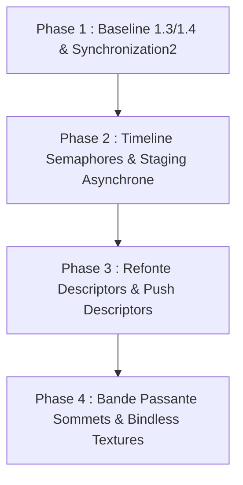

# 🔬 Rapport d'Audit & Recommandations : Modernisation Vulkan C++

**Projet :** biobazard3d (`bb3d`)  
**Auteur :** Antigravity Engine Specialist  
**Date :** 17 Septembre 2026  
**Environnement Détecté :** Windows, C++20, SDL3, Vulkan SDK `1.4.335.0` (`C:\VulkanSDK\1.4.335.0`)  
**Directives de Référence :** `GEMINI.md` et Compétence `vulkan-cpp`

---

## 1. Synthèse Exécutive

Le moteur **biobazard3d** dispose d'un socle graphique solide basé sur **Vulkan-Hpp**, **VMA** et le **Dynamic Rendering** (Vulkan 1.3 sans `VkRenderPass` legacy). L'architecture sépare bien la logique de la scène du rendu, avec un système d'instancing GPU via SSBO et un support des ombres directionnelles par cascades (CSM).

Cependant, l'environnement de développement dispose du SDK **Vulkan 1.4** (`1.4.335.0`), tandis que la base de code actuelle :
1. N'active que les fonctionnalités minimales de Vulkan 1.3 (`dynamicRendering`).
2. Utilise des primitives de synchronisation héritées de **Vulkan 1.0** (`pipelineBarrier` legacy avec masques de stages restreints).
3. Souffre de blocages CPU/GPU synchrones (`waitIdle()`, `waitForFences()`) lors des transferts de textures et de buffers.
4. Gère les objets Vulkan via des handles bruts sans **`vk::raii`**, avec des risques de fuite de Descriptor Sets.
5. Utilise une structure "Uber-Vertex" unique de **88 octets** pour tous les usages (interdite en production par `GEMINI.md`).
6. N'exploite pas encore les fonctionnalités phares modernes : **Synchronization2**, **Timeline Semaphores**, **Push Descriptors**, **Bindless Textures (Descriptor Indexing)**, **Extended Dynamic State**, et **Pipeline Cache persistant sur disque**.

Ce document dresse un diagnostic ligne par ligne et présente un plan d'évolution pragmatique par étapes pour hisser le backend graphique au niveau des standards modernes "Modern Engine" sans régression.

---

## 2. Audit Détaillé de l'Existant (Fichier par Fichier)

### 2.1 `VulkanContext` (`include/bb3d/render/VulkanContext.hpp`, `src/bb3d/render/VulkanContext.cpp`)

| Élément | État Actuel | Diagnostic / Problème | Opportunité Moderne |
| :--- | :--- | :--- | :--- |
| **API Version** | `VK_API_VERSION_1_3` | Demande la version 1.3 alors que le SDK 1.4 est installé. | Passer à `VK_API_VERSION_1_3` ou `VK_API_VERSION_1_4` en profitant des fonctionnalités Core 1.4 (Push Descriptors, Maintenance 5/6). |
| **Chaînage `pNext`** | Pointeur brut : `deviceCreateInfo.pNext = &dynamicRenderingFeatures;` (L.128) | Non extensible, risque de pointeurs pendants ou incompatibilités de structure. | Utiliser `vk::StructureChain<vk::DeviceCreateInfo, vk::PhysicalDeviceVulkan13Features, vk::PhysicalDeviceVulkan12Features>`. |
| **Features Activées** | Uniquement `dynamicRenderingFeatures` | `synchronization2`, `timelineSemaphore`, `descriptorIndexing`, `bufferDeviceAddress` ne sont **pas activées** ! | Activer `synchronization2`, `timelineSemaphore`, `descriptorIndexing`, `inlineUniformBlock` via `PhysicalDeviceVulkan13Features` et `PhysicalDeviceVulkan12Features`. |
| **Encapsulation C++** | Handles bruts `vk::Device`, `vk::Instance`, etc. Nettoyage manuel dans `cleanup()`. | Boilerplate important, ordre de destruction critique, risque de fuites lors des exceptions dans les constructeurs. | Migration progressive vers `vk::raii` (`vk::raii::Device`, `vk::raii::CommandPool`, etc.) tout en gardant l'opacité pour le code client. |
| **Transfer Queue** | `m_transferQueueFamily = gIdx;` (L.109) | La file de transfert utilise la même queue que le rendu graphique. | Détecter une file de transfert dédiée (`vk::QueueFlagBits::eTransfer` sans graphique) pour le streaming asynchrone sans concurrence sur la queue graphique. |
| **Transferts Staging** | `endSingleTimeCommands` appelle `m_graphicsQueue.waitIdle()` (L.201). `endTransferCommandsAsync` appelle immédiatement `m_device.waitForFences` (L.235). | **Tous les uploads bloquent le CPU !** Les transferts de textures ne sont pas réellement asynchrones. | Remplacer les attentes synchrones par des `Timeline Semaphores` et des clôtures différées (libération en début de frame suivante ou via coroutine/JobSystem). |
| **Pipeline Cache** | Créé vide à chaque exécution (`createPipelineCache`, L.152), détruit sans sauvegarde. | Chaque lancement de l'application recompile tous les shaders depuis zéro, créant des micro-saccades. | Sauvegarder le blob binaire (`m_pipelineCache.getData()`) dans `cache/pipeline_cache.bin` et le recharger au démarrage. |

---

### 2.2 `Renderer` (`include/bb3d/render/Renderer.hpp`, `src/bb3d/render/Renderer.cpp`)

| Élément | Ligne(s) | Diagnostic / Problème | Opportunité Moderne |
| :--- | :--- | :--- | :--- |
| **Barrières Mémoire** | L.464, L.468, L.481, L.485, L.493, L.497, L.513, L.624, L.627, L.645, L.873, L.960, L.1104, L.1111, L.1190, L.1256, L.1266 | Utilisation de `cb.pipelineBarrier()` (Vulkan 1.0) avec `eTopOfPipe`, `eBottomOfPipe`, `eColorAttachmentOutput`. | Remplacer par **`pipelineBarrier2`** (`Synchronization2`) avec `vk::DependencyInfo` et `vk::ImageMemoryBarrier2`. Clarifie les dépendances et optimise le scheduling matériel GPU. |
| **Dynamic Rendering API** | L.373, L.541, L.635, L.909, L.1128 | Initialise `vk::RenderingInfo` via des agrégats bruts non nommés `{ {}, {{0, 0}, extent}, 1, 0, 1, &colorAttr, ... }`. | Utiliser la syntaxe C++20 avec designated initializers ou `vk::RenderingInfoKHR` structuré, et exploiter les attachments de resolve MSAA natifs. |
| **Pipeline Shadow Mapping** | L.879 | `auto& shadowPipeline = m_pipelines[static_cast<MaterialType>(99)];` (Valeur magique `99`). | Définir un type explicite (`MaterialType::Shadow` ou pipeline dédié hors de l'enum matériau utilisateur). |
| **Instancing & Batching** | L.830-835 | `m_instanceBuffers` écrit les matrices de transformation CPU vers GPU chaque frame. Boucle de draw call par mesh/matériau. | Transitionner vers **GPU-Driven Rendering** : Compute Shader pour le culling & LOD, puis un unique `vkCmdDrawIndexedIndirect`. |
| **Debug & Profiling** | Absent | Aucun marqueur de debug Vulkan dans les command buffers. Impossible d'identifier clairement les passes dans RenderDoc ou Nsight Graphics. | Insérer `cb.beginDebugUtilsLabelEXT()` / `cb.endDebugUtilsLabelEXT()` pour baliser les passes (Shadows, Main PBR, Picking, ImGui UI) et intégrer `TracyVkZone`. |

---

### 2.3 `Material` & Gestion des Descriptors (`include/bb3d/render/Material.hpp`, `src/bb3d/render/Material.cpp`)

| Élément | Ligne(s) | Diagnostic / Problème | Opportunité Moderne |
| :--- | :--- | :--- | :--- |
| **Descriptor Sets par Matériau** | `Material.hpp` L.116-118 | Chaque instance de matériau possède un tableau de 3 `UniformBuffer` et alloue 3 `DescriptorSet` dans `m_descriptorPool`. | Énorme overhead de descripteurs et de fragmentation de pool. De plus, les sets ne sont **jamais libérés** dans le destructeur (`~PBRMaterial`) -> **Fuite de descripteurs** si des matériaux sont instanciés dynamiquement ! |
| **Push Descriptors** | Absent | Les paramètres scalaires des matériaux (`baseColorFactor`, `roughness`, `metallic`, etc.) changent fréquemment. | Avec **Push Descriptors** (`VK_KHR_push_descriptor` ou Core 1.4), on élimine totalement l'allocation de descriptor sets pour les matériaux ! Les données sont directement "pushées" dans le command buffer. |
| **Bindless Textures** | Absent | Chaque changement de matériau ré-associe 4 à 5 textures dans un Descriptor Set et casse le batching d'instancing. | Avec **Descriptor Indexing (Bindless)**, toutes les textures sont stockées dans un unique tableau global `sampler2D textures[]`. Les matériaux n'ont qu'à spécifier des `uint textureIndex` dans leurs Push Constants. Zéro changement de descriptor set en cours de frame ! |

---

### 2.4 `Vertex` & Layouts de Sommets (`include/bb3d/render/Vertex.hpp`, `include/bb3d/render/Mesh.hpp`)

| Élément | Diagnostic / Problème | Règle `GEMINI.md` enfreinte | Solution Moderne |
| :--- | :--- | :--- | :--- |
| **Structure Uber-Vertex** | `struct Vertex` regroupe `position` (12o), `normal` (12o), `color` (12o), `uv` (8o), `tangent` (16o), `joints` (16o), `weights` (16o) = **88 octets par sommet**. | *"Pour optimiser la bande passante mémoire et le Vertex Fetch, le moteur supporte plusieurs layouts de sommets. L'utilisation d'une structure Uber-Vertex unique est proscrite pour la production."* | 1. Séparer le buffer de positions (`VertexPos`, 12 octets) pour les shadow maps, le z-prepass et le picking.<br>2. `VertexStatic` (48 octets) pour les objets statiques PBR.<br>3. `VertexAnim` réservé aux objets avec armatures. |
| **Impact Shadow Mapping** | La passe d'ombres (`shadow.vert`) ne lit que la position, mais Vulkan transfère les 88 octets par sommet depuis la VRAM ! | Sur une scène de 200 000 sommets avec 4 cascades d'ombres, cela représente **70 Mo de bande passante inutile gaspillée à chaque frame** ! | En bindant un buffer `VertexPos` dédié de 12 octets, la bande passante de la passe d'ombres est divisée par **7,3** ! |

---

### 2.5 `GraphicsPipeline` (`include/bb3d/render/GraphicsPipeline.hpp`, `src/bb3d/render/GraphicsPipeline.cpp`)

| Élément | Diagnostic / Problème | Opportunité Moderne |
| :--- | :--- | :--- |
| **Dynamic State** | Seuls `eViewport`, `eScissor` et `eDepthBias` sont configurés comme dynamiques (L.93-97). | En Vulkan 1.3 (`VK_EXT_extended_dynamic_state` est core), `cullMode`, `frontFace`, `primitiveTopology`, `depthTestEnable`, `depthWriteEnable`, `depthCompareOp` peuvent être dynamiques ! |
| **Multiplicité des Pipelines** | Tout changement de test de profondeur, de face culling ou de topologie impose de créer un objet `GraphicsPipeline` complet et distinct. | En activant l'état dynamique étendu, un seul pipeline peut gérer plusieurs modes de dessin sans recompilation d'état fixe. |

---

### 2.6 `Texture` (`src/bb3d/render/Texture.cpp`)

| Élément | Ligne(s) | Diagnostic / Problème | Opportunité Moderne |
| :--- | :--- | :--- | :--- |
| **Transitions de Layout** | L.315, L.332, L.344, L.367 | `transitionLayout` et `generateMipmaps` utilisent l'ancien `commandBuffer.pipelineBarrier()` avec des masques d'accès Vulkan 1.0. | Passer à `pipelineBarrier2` avec `vk::ImageMemoryBarrier2`. |
| **Génération de Mipmaps** | L.320-350 | Utilise des boucles `vkCmdBlitImage` synchronisées par des barrières de stages successives. | Les barrières `DependencyInfo` simplifient grandement la lisibilité du code de downsampling mipmap. |

---

## 3. Matrice de Modernisation Vulkan C++

Voici le comparatif entre le fonctionnement actuel de `biobazard3d` et les standards modernes cibles :

```
┌──────────────────────────────────────┬────────────────────────────────────────┬────────────────────────────────────────┐
│ Domaine                              │ Implémentation Actuelle                │ Standard Vulkan Moderne Cible          │
├──────────────────────────────────────┼────────────────────────────────────────┼────────────────────────────────────────┤
│ Version API                          │ Vulkan 1.3 (partiel)                   │ Vulkan 1.3+ / 1.4 Core Features        │
│ C++ Wrapper                          │ Vulkan-Hpp brut (destroy manuel)       │ vk::raii + vk::StructureChain          │
│ Synchronisation Pipeline             │ pipelineBarrier (Vulkan 1.0)           │ pipelineBarrier2 + DependencyInfo      │
│ Synchronisation Queues/Frames        │ Fences + Semaphores binaires           │ Timeline Semaphores (Compteur monotone)│
│ Uploads Staging                      │ Bloquants (waitIdle / waitForFences)   │ Queue Transfer Asynchrone non-bloquante│
│ Paramètres Matériaux                 │ UBO + DescriptorSet par matériau/frame │ Push Descriptors (Zéro allocation)     │
│ Texturation                          │ Descriptors dédiés par matériau        │ Bindless (Descriptor Indexing)         │
│ Layout de Sommets                    │ Uber-Vertex unique (88 octets)         │ Streams séparés (Pos 12o + Attr 36o)   │
│ États de Pipeline                    │ Pipelines dupliqués selon Rasterizer   │ Extended Dynamic State (Vulkan 1.3)    │
│ Cache Shaders                        │ PipelineCache en mémoire, non persisté │ Sauvegarde binaire sur disque          │
│ Debug GPU                            │ Logs texte console uniquement          │ DebugUtils Labels + Tracy GPU Zones    │
└──────────────────────────────────────┴────────────────────────────────────────┴────────────────────────────────────────┘
```

---

## 4. Feuille de Route de Modernisation Recommandée (Par Phases)

Pour garantir une transition sans régression et respecter la méthodologie TDD avec validation continue via les 29 tests unitaires existants (`unit_test_*.cpp`), nous proposons un plan découpé en **4 phases progressives** :



---

### 🔹 Phase 1 : Baseline 1.3/1.4, StructureChain & Synchronization2 (Priorité Immédiate)

**Objectif :** Éliminer les primitives Vulkan 1.0 obsolètes et stabiliser la synchronisation.

1. **`VulkanContext` Modernisé :**
   - Utiliser `vk::StructureChain` pour initialiser le device :
     ```cpp
     vk::StructureChain<
         vk::DeviceCreateInfo,
         vk::PhysicalDeviceVulkan13Features,
         vk::PhysicalDeviceVulkan12Features
     > chain;
     
     auto& v13 = chain.get<vk::PhysicalDeviceVulkan13Features>();
     v13.dynamicRendering = VK_TRUE;
     v13.synchronization2 = VK_TRUE;
     v13.maintenance4 = VK_TRUE;
     
     auto& v12 = chain.get<vk::PhysicalDeviceVulkan12Features>();
     v12.timelineSemaphore = VK_TRUE;
     v12.descriptorIndexing = VK_TRUE;
     ```
2. **Migration vers `pipelineBarrier2` :**
   - Remplacer toutes les occurrences de `cb.pipelineBarrier(...)` dans `Renderer.cpp` et `Texture.cpp` par `cb.pipelineBarrier2(vk::DependencyInfo{...})`.
   - Utiliser `vk::PipelineStageFlagBits2` et `vk::AccessFlagBits2` pour des dépendances explicites sans ambigüité.
3. **Debug Labels Vulkan :**
   - Encadrer les passes de rendu avec `cb.beginDebugUtilsLabelEXT()` et `cb.endDebugUtilsLabelEXT()` (`"Shadow Pass"`, `"Scene PBR"`, `"Color Picking"`, `"UI Overlay"`).
4. **Validation :**
   - Exécuter la suite complète de tests `ctest` et vérifier l'absence d'erreurs de synchronisation dans les validation layers.

---

### 🔹 Phase 2 : Timeline Semaphores & Staging Buffer Réellement Asynchrone

**Objectif :** Supprimer les `waitIdle()` CPU bloquants lors du chargement de textures et modèles.

1. **Timeline Semaphores :**
   - Remplacer les clôtures par frame par un `Timeline Semaphore` de frame incrémenté à chaque présentation.
2. **File de Transfert Asynchrone :**
   - Utiliser une queue de transfert dédiée lorsque le GPU en propose une.
   - Soumettre les uploads de `Texture` et `Buffer` sur la queue de transfert avec signalement d'un timeline semaphore.
   - Libérer les ressources de staging sans bloquer le thread principal.
3. **Persistance du Pipeline Cache :**
   - Sauvegarder `m_pipelineCache.getData()` dans `assets/cache/pipelines.bin` au shutdown.
   - Charger le cache binaire à l'initialisation de `VulkanContext`.

---

### 🔹 Phase 3 : Push Descriptors & Élimination des Fuites de Matériaux

**Objectif :** Résoudre le goulot d'étranglement des 2000 Descriptor Sets et supprimer la fuite de mémoire des matériaux.

1. **Suppression de la fuite actuelle :**
   - En phase transitoire, s'assurer que `Material::~Material()` libère proprement ses sets dans le pool ou implémenter un `DescriptorAllocator` dynamique.
2. **Push Descriptors :**
   - Activer `pushDescriptor` (via extension 1.3 ou Core 1.4).
   - Les paramètres scalaires (`baseColorFactor`, `roughness`, `metallic`, etc.) sont directement passés par `cb.pushDescriptorSet(...)` sans allouer de `vk::DescriptorSet` permanent.
3. **Extended Dynamic State :**
   - Activer `extendedDynamicState` pour contrôler `cullMode`, `depthCompareOp`, `depthWriteEnable` dynamiquement sans multiplier les instances de `GraphicsPipeline`.

---

### 🔹 Phase 4 : Optimisation Bande Passante (Streams Sommets) & Bindless (Haute Performance)

**Objectif :** Respecter strictement la règle de `GEMINI.md` et diviser par 4 la bande passante géométrie.

1. **Découplage des Buffers de Sommets :**
   - Séparer la position (`VertexPos`, 12 octets) des autres attributs (`VertexStatic`, 36 octets).
   - Mettre à jour la passe d'ombres (`shadow.vert`) et de picking pour n'utiliser **que** le buffer de positions.
   - Adapter `Mesh` pour gérer les multi-buffers de sommets (`binding 0` : positions, `binding 1` : normales/UVs).
2. **Bindless Textures (Descriptor Indexing) :**
   - Allouer un unique `DescriptorSet` contenant un tableau non borné de textures `sampler2D allTextures[]`.
   - Dans le shader PBR, indexer les textures dynamiquement :
     ```glsl
     layout(set = 1, binding = 0) uniform sampler2D allTextures[];
     // Dans fragMain :
     vec4 albedo = texture(allTextures[nonuniformEXT(pc.albedoIndex)], inUV);
     ```
   - Bénéfice : Zéro interruption de batch lors du dessin d'objets aux matériaux différents !

---

## 5. Fichiers et Ressources Clés Identifiés

```
bb3d/
├── docs/
│   ├── README.md                            <-- Index de la documentation technique
│   └── vulkan_audit/
│       └── RAPPORT_AUDIT_VULKAN_MODERNE.md   <-- (Ce document)
├── tasks/
│   ├── ROADMAP.md                           <-- Backlog & Items d'audit Vulkan
│   ├── CODE_REVIEW.md                       <-- Catalogue des bugs statiques
│   ├── HISTORY.md                           <-- Historique compact
│   └── active/                              <-- Tâches en cours

├── include/bb3d/render/
│   ├── VulkanContext.hpp                    <-- Initialisation, Queues, Synchronization2
│   ├── Renderer.hpp                         <-- Passes de rendu, Barrières, Dynamic Rendering
│   ├── GraphicsPipeline.hpp                 <-- Dynamic states, Layouts
│   ├── Material.hpp                         <-- Descriptors, Push Descriptors
│   ├── Buffer.hpp / StagingBuffer.hpp       <-- Uploads asynchrones, Timeline Semaphores
│   └── Vertex.hpp / Mesh.hpp                <-- Découplage de l'Uber-Vertex
└── src/bb3d/render/
    ├── VulkanContext.cpp
    ├── Renderer.cpp
    ├── Material.cpp
    └── Texture.cpp
```

---

## 6. Prochaine Étape

Conformément au **Workflow IA Obligatoire** défini dans `GEMINI.md` (Règle 7) :
1. Ce rapport d'audit pose les fondations techniques de la recherche.
2. Aucune modification du code source n'a été effectuée lors de cette phase d'exploration.
3. Dès validation de ce compte-rendu et sélection de l'axe de travail prioritaire par l'utilisateur, nous engagerons l'étape de **Brainstorming (`brainstorming`)** pour concevoir la première brique d'amélioration (ex: Phase 1 : Baseline Vulkan 1.3/1.4 & Synchronization2).
