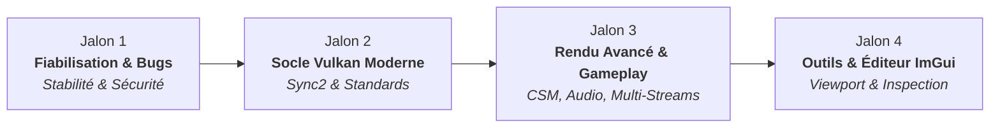

# 🗺️ Feuille de Route Stratégique & Backlog - biobazard3d (`bb3d`)

Ce document constitue le **plan de route officiel** du moteur `bb3d`. Il organise les chantiers techniques et fonctionnels en **4 jalons séquentiels et cohérents**, garantissant la stabilité, la modernité de l'API graphique Vulkan et les capacités de rendu temps réel.

---

## 🧭 Fonctionnement & Prise en Charge de Tâches

Le développement de `bb3d` est conçu pour permettre le travail collaboratif sans interférence entre développeurs et agents IA (Antigravity, OpenCode, Mistral Vibe Coda, etc.) :

1. **Sélection :** Choisir un chantier prioritaire ci-dessous ou un bug du catalogue [`CODE_REVIEW.md`](CODE_REVIEW.md).
2. **Réservation & Fiche :**
   - Créer ou mettre à jour une fiche dans [`active/`](active/) (ex: `tasks/active/TASK-XXX.md`) basée sur [`templates/TASK_REVIEW_TEMPLATE.md`](templates/TASK_REVIEW_TEMPLATE.md).
   - Indiquer le statut `[READY FOR ARCHITECTURE REVIEW]`, l'Auteur (`@dev`) et le(s) Reviewer(s).
3. **Branche Git :** Isoler le développement sur une branche dédiée (ex: `feat/nom-de-tache` ou `fix/b8-material-ubo`).
4. **Approbation d'Architecture :** Valider formellement la conception avant tout codage source.
5. **Cycle TDD :** Rédiger le test unitaire en premier (`tests/unit_test_*.cpp`), implémenter la solution minimale, et valider la suite de tests :
   ```bash
   cmake --build build --config Debug -j && ctest --test-dir build -C Debug --output-on-failure
   ```
6. **Revue Croisée :** Valider les checkpoints techniques Implémenteur & Reviewer dans la fiche `TASK-XXX.md`.
7. **Clôture & Historique :**
   - Consigner **1 entrée compacte (3 lignes max)** dans [`HISTORY.md`](HISTORY.md).
   - Déplacer la fiche vers [`archive/`](archive/).

---

## 🎯 Jalons Stratégiques (Milestones)



---

### 🛡️ Jalon 1 : Fiabilisation & Résolution des Bugs Critiques
> **Objectif :** Éliminer les conditions de course GPU, deadlocks, comportements indéfinis et fuites de mémoire identifiés dans [`tasks/CODE_REVIEW.md`](CODE_REVIEW.md) avant d'ajouter de nouvelles couches architecturales.

- [x] **Course CPU/GPU UBO Matériaux (`B8`)** : Synchronisation activée via `Material::SetCurrentFrame(m_currentFrame)` au début de `Renderer::render()`, test unitaire validé (`unit_test_25_material_frame`).
- [x] **Sécurité Swapchain Resize (`B1`)** : Reconstruction propre et symétrique de `m_renderFinishedSemaphores` selon le nouveau `imageCount` lors du resize.
- [x] **Deadlock de Fence sur échec Submit (`B2`)** : Re-signalement propre de `m_inFlightFences` dans le catch de `submitAndPresent()` pour éliminer tout deadlock à la frame suivante.
- [x] **Offset Batch Ombres (`B3`)** : Réinitialisation `lastMesh = nullptr` sur le saut de non-caster dans `renderShadows()` garantissant des matrices d'ombres correctes.
- [x] **Picking GPU & Fuites de Sets (`B4`, `B5`, `B6`)** :
  - Libération propre des descriptor sets de picking via `freeDescriptorSets` et préservation des buffers lors des redimensionnements (`B4`).
  - Allocation eager des pipelines/ressources à l'init et redimensionnement d'images dédié dans `m_resizeRequested` hors `cb.begin()`, éliminant les `dev.waitIdle()` mid-frame (`B5`).
  - Synchronisation de readback par fence isolée (`m_pickingFence`) et pool transitoire dédié, éliminant le stall `queue.waitIdle()` global (`B6`), test unitaire validé (`unit_test_26_picking`).
- [x] **Robustesse Physique Jolt (`B14`, `B15`, `B16`, `B20`, `B21`)** :
  - Clamper le nombre de threads (`std::max(1, hardware_concurrency - 1)`) (`B14`).
  - Ajouter des gardes `entity.has<TransformComponent>()` dans `createRigidBody` et `createCharacterController` (`B15`, `B20`).
  - Sécuriser l'allocation de corps (`CreateBody != nullptr`) (`B16`).
- [x] **JobSystem Busy-Poll (`B24`, `B25`)** : Architecture hybride Spin-Then-Park (`_mm_pause` hot path + park OS au repos), 0% CPU idle, wake latency 30 µs, test unitaire validé (`unit_test_08_core_systems`).
- [x] **Nettoyage du Code Mort & Fichiers Obsolètes (`D3`, `D4`, `D5`, `ND1`)** :
  - Supprimer `m_instanceTransforms` non lu (`D3`).
  - Supprimer `getMaterialForTexture` et `m_defaultMaterials` inutilisés (`D4`).
  - Supprimer le bloc d'horizon culling commenté (`D5`).
  - Supprimer `StagingBuffer::submitCopy` non appelé et buggé (`ND1`).

---

### ⚡ Jalon 2 : Socle Vulkan 1.3 / 1.4 Moderne & Synchronisation
> **Objectif :** Aligner l'infrastructure graphique sur les standards modernes documentés dans le [Rapport d'Audit Vulkan](../docs/vulkan_audit/RAPPORT_AUDIT_VULKAN_MODERNE.md) (SDK `1.4.335.0` actif).

- [x] **Initialisation Vulkan 1.3/1.4 via `vk::StructureChain`** :
  - Négociation dynamique `VK_API_VERSION_1_4` / fallback 1.3, interrogation préalable type-safe via `m_physicalDevice.getFeatures2(&queryChain)`, activation `StructureChain` des features core (`synchronization2`, `dynamicRendering`, `timelineSemaphore`, `pushDescriptor`, bindless), VMA aligné (`unit_test_02_vulkan_init` PASS).
- [ ] **Migration Synchronization2 (`pipelineBarrier2`)** :
  - Bannir l'API legacy `pipelineBarrier` (17+ occurrences).
  - Utiliser systématiquement `vk::DependencyInfo` et `vk::ImageMemoryBarrier2` avec les stages et accès 64-bit (`vk::PipelineStageFlagBits2`, `vk::AccessFlagBits2`).
- [ ] **Timeline Semaphores & Transferts Réellement Asynchrones (`B11`)** :
  - Remplacer les semaphores binaires et `waitForFences()` bloquants par des Timeline Semaphores.
  - Découpler les chargements d'assets (textures, meshes) sur une file de transfert dédiée sans stall de la frame (`dev.waitIdle()`).
- [ ] **Instrumentation DebugUtils & Profiling Tracy GPU** :
  - Baliser les command buffers et passes de rendu avec `vkCmdBeginDebugUtilsLabelEXT` / `vkCmdEndDebugUtilsLabelEXT`.
  - Intégrer les zones de timing GPU via `TracyVkZone`.
- [ ] **Pipeline Cache Persistant** :
  - Sérialiser l'objet `vk::PipelineCache` dans `assets/cache/pipelines.bin` pour éliminer les micro-saccades lors des lancements ultérieurs.
- [ ] **Extended Dynamic State (Vulkan 1.3)** :
  - Exploiter les états dynamiques étendus (cull mode, front face, depth compare op, primitive topology) pour diviser le nombre de pipelines graphiques requis.

---

### 🎨 Jalon 3 : Rendu Graphique Avancé & Gameplay
> **Objectif :** Améliorer la fidélité visuelle, la flexibilité des assets et les systèmes de jeu interactifs.

- [ ] **Améliorations Cascaded Shadow Maps (CSM)** *(Fiche active : [`TASK-CSM_Improvement_Plan.md`](active/TASK-CSM_Improvement_Plan.md))* :
  - Implémenter la répartition pratique des splits (Practical Split Scheme).
  - Normal Bias adaptatif et Texel Snapping stabilisé pour éliminer l'acné d'ombre et le chatoiement.
  - Frustum culling par cascade pour réduire les draw calls redondants.
- [ ] **Découplage Multi-Streams Sommets (Fin de l'Uber-Vertex)** :
  - Séparer la géométrie en flux : `VertexPos` (12 octets) pour les shadow passes, z-prepass et picking, et `VertexStatic` (36 octets) pour les attributs PBR.
  - Réduire l'empreinte bande-passante mémoire de plus de 60% sur les passes de profondeur.
- [ ] **Push Descriptors & Allocateur de Descriptors Moderne** :
  - Remplacer les pools rigides par un allocateur dynamique à blocs (pages de descripteurs).
  - Évaluer les Push Descriptors pour les UBOs et paramètres fréquents.
- [ ] **SSBO Matériaux & Bindless Textures** :
  - Stocker les propriétés des matériaux dans un unique SSBO global indexé par instance.
  - Tableau de textures non dimensionné (Descriptor Indexing / Bindless) pour éliminer les réallocations de bindings de texture par draw call.
- [ ] **Dynamic Lights (SSBO)** :
  - Remplacer le tableau fixe de 10 lumières par un SSBO redimensionnable pour un éclairage riche.
- [ ] **Z-Prepass (Depth Pre-pass)** :
  - Passe de pré-remplissage du depth buffer avec `VertexPos` pour éliminer l'overdraw sur scènes denses.
- [ ] **Système Audio 3D (`miniaudio`)** :
  - Intégration de miniaudio pour les sources sonores 3D spatialisées et le listener.
- [ ] **Post-Processing & Render To Texture (RTT)** :
  - Classe générique `RenderTarget` offscreen.
  - Pipeline de post-traitement composable (Tone Mapping, Bloom, SSAO).

---

### 🎛️ Jalon 4 : Outils, Éditeur ImGui & Ergonomie
> **Objectif :** Offrir un environnement d'édition temps réel et de débogage visuel interactif (`BB3D_ENABLE_EDITOR`).

- [ ] **Intégration Dear ImGui (Docking Branch)** :
  - Backends SDL3 et Vulkan avec support du Dynamic Rendering.
  - Couche d'abstraction `bb3d::ImGuiLayer` (Init, Event Intercept, Render).
- [ ] **Viewport de Rendu Dédié** :
  - Rendu de la scène dans une texture offscreen injectée dans une fenêtre ImGui redimensionnable avec mapping d'input relatif.
- [ ] **Panneaux d'Édition & Inspection** :
  - Arborescence de scène (Scene Hierarchy) avec ajout/suppression d'entités en direct.
  - Inspecteur de composants (Transform, Mesh, Material, RigidBody, Camera, Light).
  - Console de logs interactive branchée sur `spdlog`.
- [ ] **Gizmos de Manipulation 3D** :
  - Gizmos de translation, rotation et échelle dans le viewport.
- [ ] **Moniteur de Métriques & Diagnostic** :
  - Graphiques de frametime CPU/GPU, occupation mémoire VMA, état des pools de threads.

---

## 📦 Archive des Réalisations (Fondations Validées)

Toutes les briques fondamentales ci-dessous ont été validées et archivées :

- [x] 🏗️ **Core Architecture** : Singleton Engine, Windowing SDL3, Logging spdlog, Profiling Tracy.
- [x] 🎨 **Vulkan Backend Init** : Initialisation Vulkan 1.3, Dynamic Rendering natif sans RenderPass, allocation mémoire VMA.
- [x] 💎 **Descriptor Management** : Triple Buffering pour les Descriptor Sets des matériaux.
- [x] 📦 **Asset Loading** : Chargeur OBJ (`tinyobjloader`) et glTF 2.0 (`fastgltf`) avec extraction des textures et matériaux.
- [x] 💎 **PBR Rendering** : Modèle Cook-Torrance complet (Albedo, Normal, ORM, Emissive).
- [x] ⚡ **GPU Instancing** : Batching automatique par mesh/matériau via SSBO d'instances.
- [x] 💡 **Multi-Lights Base** : Support initial de 10 lumières simultanées (directionnelles et ponctuelles).
- [x] ✨ **Cel-Shading** : Rendu stylisé toon avec quantification et outlines.
- [x] 📂 **Serialization 2.0** : Sauvegarde et rechargement de scènes complètes au format JSON.
- [x] 🧵 **JobSystem & ECS** : Thread pool multithread et registre de composants EnTT optimisé.
- [x] 📐 **Maths & Camera** : Intégration GLM, caméras FPS et Orbitale interactives.
- [x] 🌍 **Intégration Jolt Physics** : RigidBodies dynamiques/statiques, colliders, raycasting et character controller de base.
- [x] 🕵️ **Frustum Culling CPU** : Rejet des objets hors champ via les AABB.
- [x] 🗺️ **Compression Textures** : Support du format compressé BC7 et génération de mipmaps.
