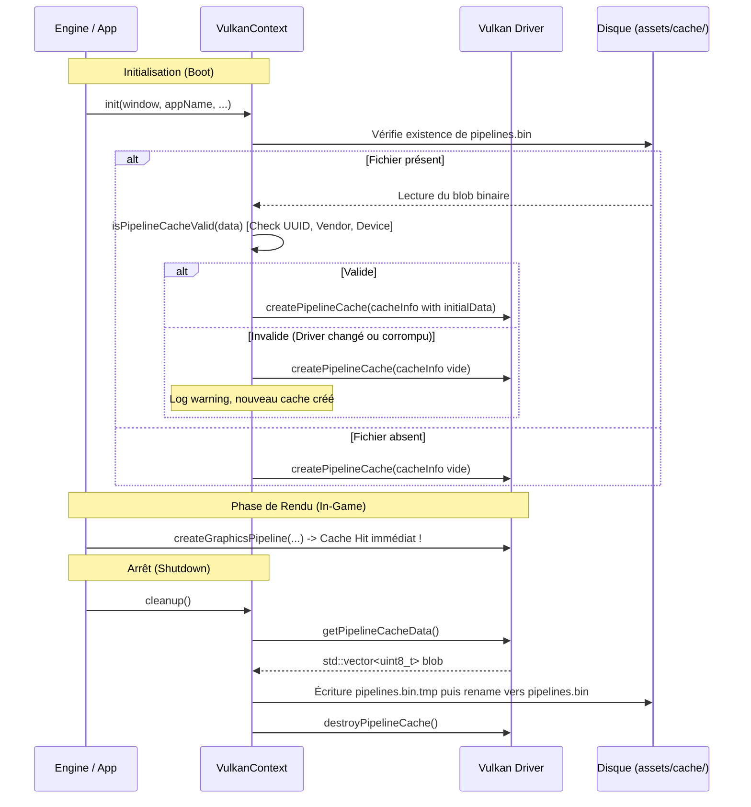

# 📐 Design Doc : Pipeline Cache Persistant (`vk::PipelineCache`)

- **Date :** 2026-09-26
- **Auteur :** Antigravity
- **Statut :** PROPOSÉ (En cours de validation)
- **Objectif :** Éliminer les micro-saccades de compilation de shaders (shader compilation hitches) en persistant le cache binaire `vk::PipelineCache` sur disque (`assets/cache/pipelines.bin`).

---

## 1. Contexte & Problématique

Dans les moteurs de jeu 3D modernes basés sur Vulkan, la création d'un pipeline graphique (`vkCreateGraphicsPipelines`) effectue la compilation finale du code intermédiaire SPIR-V vers le micro-code machine natif (ISA) du GPU cible (NVIDIA, AMD, Intel).

Actuellement dans `bb3d` :
- `m_pipelineCache` est créé vierge à chaque lancement de l'application dans `VulkanContext::initLogicalDevice` (`cacheInfo.initialDataSize = 0`).
- Au shutdown dans `VulkanContext::cleanup()`, l'objet `m_pipelineCache` est détruit sans que ses données ne soient sauvegardées sur disque.
- **Conséquence :** À chaque lancement ou changement de scène, tous les shaders sont recompilés intégralement, entraînant des micro-saccades et allongeant les temps de chargement.

---

## 2. Objectifs & Exigences

1. **Zéro Stutter au Lancement :** Recharger les shaders déjà compilés pour ramener le temps de création de pipeline de dizaines de millisecondes à une fraction de milliseconde (cache hit direct).
2. **Validation Stricte du Header Vulkan (Robustesse Pilote & GPU) :**
   La spécification Vulkan définit une structure d'en-tête de 32 octets :
   ```cpp
   struct PipelineCacheHeader {
       uint32_t headerSize;            // sizeof(PipelineCacheHeader) == 32
       uint32_t headerVersion;         // VK_PIPELINE_CACHE_HEADER_VERSION_ONE (1)
       uint32_t vendorID;              // m_physicalDeviceProperties.vendorID
       uint32_t deviceID;              // m_physicalDeviceProperties.deviceID
       uint8_t  pipelineCacheUUID[VK_UUID_SIZE]; // 16 octets d'UUID matériel/driver
   };
   ```
   Si la taille < 32 octets, ou si l'UUID / vendor / device ne correspond pas au GPU physique et pilote actuels (ex: mise à jour des drivers NVIDIA/AMD, changement de carte graphique, ou fichier corrompu), le cache doit être ignoré et régénéré proprement sans crasher ni bloquer le moteur.
3. **Écriture Atomique & Sécurisée :**
   Sauvegarde via fichier temporaire (`.tmp`) puis remplacement atomique (`std::filesystem::rename`) pour éviter toute corruption de fichier en cas de fermeture brutale.
4. **Configuration & Opacité (Règle 1 AGENTS.md) :**
   Chemin du cache configurable via `GraphicsConfig` (`pipelineCachePath = "assets/cache/pipelines.bin"`, `enablePipelineCache = true`). L'API publique de haut niveau ne manipule aucun type Vulkan.
5. **Méthodes Utilitaires pour TDD :**
   `loadPipelineCache()` et `savePipelineCache()` exposées sur `VulkanContext` pour permettre un test unitaire exhaustif et indépendant (`unit_test_35_pipeline_cache.cpp`).

---

## 3. Architecture Détaillée

### 3.1 Modification de `GraphicsConfig` (`include/bb3d/core/Config.hpp`)

```cpp
struct GraphicsConfig {
    // ... existant ...
    bool enablePipelineCache = true;                  ///< Active la persistance disque du PipelineCache Vulkan
    std::string pipelineCachePath = "assets/cache/pipelines.bin"; ///< Chemin du fichier cache binaire
};
```

### 3.2 Nouvelles Méthodes sur `VulkanContext` (`include/bb3d/render/VulkanContext.hpp`)

```cpp
/** @brief Vérifie si un blob binaire correspond à un PipelineCache Vulkan valide pour le GPU actuel. */
[[nodiscard]] bool isPipelineCacheValid(std::span<const uint8_t> data) const noexcept;

/** @brief Sauvegarde le contenu actuel du PipelineCache sur disque de manière atomique. */
bool savePipelineCache(const std::filesystem::path& path) const;

/** @brief Charge et applique un cache depuis un fichier disque s'il est valide. */
bool loadPipelineCache(const std::filesystem::path& path);

/** @brief Définit le chemin par défaut du fichier de cache. */
void setPipelineCachePath(std::string_view path);

/** @brief Récupère le chemin par défaut du fichier de cache. */
[[nodiscard]] const std::filesystem::path& getPipelineCachePath() const noexcept;
```

### 3.3 Flux d'Exécution



---

## 4. Stratégie de Test TDD (`unit_test_35_pipeline_cache.cpp`)

1. **Test 1 : Validation de l'En-tête (Header Validation) :**
   - Données tronquées (< 32 octets) -> Rejeté.
   - Données avec UUID erroné -> Rejeté.
   - Données avec vendorID / deviceID incorrect -> Rejeté.
   - Données valides générées par le GPU -> Accepté.
2. **Test 2 : Sauvegarde et Rechargement Réel :**
   - Création d'un pipeline graphique de test dans `VulkanContext`.
   - Appel `savePipelineCache("test_cache.bin")`.
   - Vérification de l'existence du fichier et que sa taille est > 32 octets.
   - Création d'un second `VulkanContext` chargeant ce fichier : initialisation réussie sans erreur.
   - Nettoyage du fichier temporaire.
3. **Test 3 : Écriture atomique et résilience aux chemins inexistants :**
   - Création automatique du répertoire parent si absent (`std::filesystem::create_directories`).

---

## 5. Critères d'Acceptation

- [ ] Tous les tests automatisés CTest passent à 100% (`ctest -C Debug`).
- [ ] 0 allocation dans le hot-path de rendu.
- [ ] Zéro fuite de types Vulkan dans les headers publics client (`AGENTS.md` Règle 1).
- [ ] Écriture atomique sécurisée sur disque.
- [ ] Revalidation et double check de code effectués.
